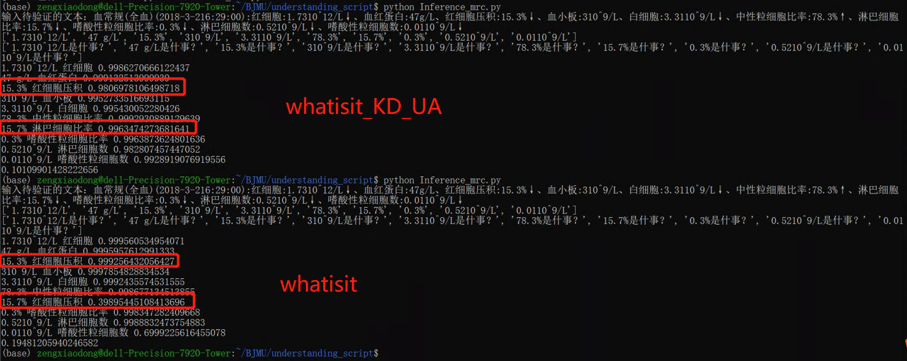

# 已申请专利

如需合作请联系zengxiaodong@stu.pku.edu.cn

基于小样本的医疗数值抽取和理解方法及装置

专利类型： 发明公开

申请(专利)号： CN202210221233.9申请日： 2022-03-09

申请公布号： CN114357144A公开公告日： 2022-04-15

申请人： 北京大学

地址： 100871 北京市海淀区颐和园路5号

发明人： 胡文蕙(老师); 刘学洋（老师）; 曾晓东

专辑： 工程科技Ⅱ辑

专题： 电力工业

分类号： G06F16/332;G06F40/216;G06K9/62;G16H50/70;G06F40/289

主分类号： G06F16/332国省代码： 11

页数： 22

代理机构： 北京路浩知识产权代理有限公司代理人： 郭亮

## 主要业务合作

与北京大学医学部公共卫生学院合作完成北京多家医院病人数据的数据治理工作

业务输入为：一段病人查房记录，其中包含一些病人的病情信息，以及各项检查项目和检查指标的实体

医学部主诉需求为提取非结构化文本数据当中的指标信息，抽取其中的指标类数值，服务于下游用药的因果预测分析

常见的指标类数值包含：

1.基本带数字和单位的指标

2.纯数字的比值类的指标

3.+—号等说明阴阳性的指标

并将指标链接到对应的度量对象、时间、和所属大类别的检查项目

输入输出样例：

    {
      "原文": "  2016-09-1009:58:46院内会诊记录单  姓名：***性别：女年龄：62岁科室：中西医结合科床号：112住院号：***  病历摘要及请求会诊的目的和要求：  患者目前考虑干燥综合征可能性大，请贵科会诊完善干眼症等相关检查。敬邀！  特请科室：眼科医生：科室会诊  请会诊医师：***,中西医结合科  请会诊日期：2016-9-98:40:42  会诊医师意见：  病史敬悉。患者诉干眼病史。查体：右0.8，左0.2，双眼角膜明，BUT下降，前房中深，瞳孔直径3mm，光敏，眼底网膜色淡红。辅助检查：泪液分泌实验：右3mm，左2mm。医学验光：右0.9，左0.8。眼压双眼15mmHg。B超：双眼玻璃体轻混。OCT未见明显异常。VEP：左眼幅值稍低。ERG双眼幅值稍低。会诊考虑双眼干眼症；双眼屈光不正。建议：玻璃酸钠眼液，点双眼，4次/日；注意休息；我科密切随访，谢邀！  会诊医师：***，眼科  会诊日期：2016-9-911:24:33-->",
      "result": [
        {
          "数值": "62",
          "单位": "岁",
          "指标名": "年龄",
          "可信度": "0.9788012504577637",
          "时间": "2016-09-10",
          "所属检查项目": ""
        },
        {
          "数值": "3",
          "单位": "mm",
          "指标名": "瞳孔直径",
          "可信度": "0.9994403123855591",
          "时间": "2016-09-10",
          "所属检查项目": "查体"
        },
        {
          "数值": "0.8",
          "单位": "",
          "指标名": "右眼视力",
          "可信度": "0.99954754114151",
          "时间": "2016-09-10",
          "所属检查项目": "查体"
        },
        {
          "数值": "0.2",
          "单位": "",
          "指标名": "左眼视力",
          "可信度": "0.9990530014038086",
          "时间": "2016-09-10",
          "所属检查项目": "查体"
        },
        {
          "数值": "3",
          "单位": "mm",
          "指标名": "右",
          "可信度": "0.8601629734039307",
          "时间": "2016-09-10",
          "所属检查项目": "泪液分泌实验"
        },
        {
          "数值": "2",
          "单位": "mm",
          "指标名": "左",
          "可信度": "0.885072648525238",
          "时间": "2016-09-10",
          "所属检查项目": "泪液分泌实验"
        },
        {
          "数值": "0.9",
          "单位": "",
          "指标名": "右眼视力",
          "可信度": "0.9916517734527588",
          "时间": "2016-09-10",
          "所属检查项目": "医学验光"
        },
        {
          "数值": "0.8",
          "单位": "",
          "指标名": "左眼视力",
          "可信度": "0.9902620315551758",
          "时间": "2016-09-10",
          "所属检查项目": "医学验光"
        },
        {
          "数值": "15",
          "单位": "mmHg",
          "指标名": "眼压双眼",
          "可信度": "0.564716100692749",
          "时间": "2016-09-10",
          "所属检查项目": ""
        },
        {
          "数值": "4",
          "单位": "次",
          "指标名": "玻璃酸钠眼液",
          "可信度": "0.4852046072483063",
          "时间": "2016-09-10",
          "所属检查项目": "建议"
        }
      ]
    }

# quantity_extraction_and_understanding

A project to extract the meaningful quantity in medical area and understand the reference of quantity

项目最初使用医学部提供的少量标注数据进行训练， 采用`MRC（Machine Reading Comprehension机器阅读理解）`的方法，对由正则表达式抽取出来的数值进行提问，得到数值的指代情况。

训练文件:[train_all](data/json/VU_squad2.0_all.json)

选取[bert-base-chinese](https://huggingface.co/bert-base-chinese)
、[bert-base-multilingual-cased](https://huggingface.co/bert-base-multilingual-cased)
、[chinese-bert-wwm](https://huggingface.co/hfl/chinese-bert-wwm)三种模型结构进行训练

预训练模型选择依据：

[bert-base-chinese](https://huggingface.co/bert-base-chinese)：作为一个最基本的中文预训练模型，可以作为一个基础数据进行比较。

[bert-base-multilingual-cased](https://huggingface.co/bert-base-multilingual-cased)
：考虑到医疗文本当中存在较多的英文字母，同时检查指标部分有较多的诸如ml,g,L等英文单位，跨语言可能会有更好的支持效果。

[chinese-bert-wwm](https://huggingface.co/hfl/chinese-bert-wwm)
：在MRC任务当中，存在较多的研究发现基于[SpanBERT](https://arxiv.org/abs/1907.10529)/[基于完整词掩蔽wwm](https://arxiv.org/pdf/1906.08101.pdf)
的预训练模型会有更好的表现。

训练脚本：

    #!/bin/bash
 
    for i in ./chinese-roberta-wwm-ext-large ./chinese-bert-wwm ./bert-base-chinese ./bert-base-multilingual-cased ;
    do
    echo $i is appoint ;
    python run_qa.py \
      --model_name_or_path $i \
      --train_file ./data/VU_squad2.0_train.json \
      --validation_file ./data/VU_squad2.0_validate.json \
      --do_train \
      --do_eval\
      --per_device_train_batch_size 6 \
      --learning_rate 3e-5 \
      --num_train_epochs 2 \
      --max_seq_length 512 \
      --doc_stride 128 \
      --output_dir ./fine_tune_mrc_squad_$i/
    done

[bert-base-chinese](https://huggingface.co/bert-base-chinese)

      {
         "EM": "20.0",
         "F1": "28.590116197312597"
      }

[bert-base-multilingual-cased](https://huggingface.co/bert-base-multilingual-cased)

      {
         "EM": "52.0",
         "F1": "71.39215686274507"
      }

[chinese-bert-wwm](https://huggingface.co/hfl/chinese-bert-wwm)

      {
         "EM": "48.0",
         "F1": "61.631987723318986"
      }

以上效果都不佳，[bert-base-multilingual-cased](https://huggingface.co/bert-base-multilingual-cased)>[chinese-bert-wwm](https://huggingface.co/hfl/chinese-bert-wwm)>[bert-base-chinese](https://huggingface.co/bert-base-chinese)

## Why [bert-base-chinese](https://huggingface.co/bert-base-chinese) failed？

中英文混合的tokenizer过程中，[bert-base-chinese](https://huggingface.co/bert-base-chinese)中出现太多[UNK]

在医学文本当中含有较多的英文字母表述。例如，“T37°C”表示体温37度；“剂量：33mg”当中的“mg”是一个度量剂量的单位；“直径3mm”当中的“mm”是一个度量长度的单位；在后续的BERT-MRC问答方法当中，需要用到BertTokenizer。中文tokenizer是以字符级别进行的tokenize，但是当遇到英文字母和数字时会得到下面的结果：

|  子词划分情况   | 对应索引                           |分词结果|
|  ----  |--------------------------------|----  |
| t3##7##°c  | [101, 11291, 8161, 9953, 102]  |['[CLS]', 't37°c', '[SEP]']|
| 3m##g  | [101, 9192, 8181, 102]         |['[CLS]', '3mg', '[SEP]']|
|3mm    | [101, 12064, 102]              |['[CLS]', '3mm', '[SEP]']|

这样的分词方式使得下游模型不能准确地理解T 37°C，3 mg和3 mm。 当进行提问“T37°C指的是？”时，无论怎么进行模型训练，模型的输出都只能是[T3,7,°c, T37°C, T37, 7°C, T37°C]

其中的一个或者很长的表述，显然不是我们所预期的结果。 因此考虑在预处理的过程中，在英文和数字之间加入空格修正，以达到正确地分词方式。

|  子词划分情况   | 对应索引                          |分词结果|
|  ----  |-------------------------------|----  |
| t、37##°c  |   [101, 162, 8234, 9953, 102] |    ['[CLS]', 't', '37°c', '[SEP]'] |
|3、mg   | [101, 124, 9404, 102]  |  ['[CLS]', '3', 'mg', '[SEP]']|
|3、mm   | [101, 124, 8595, 102]   | ['[CLS]', '3', 'mm', '[SEP]']|

## 从分词的角度对文本需要做一些预处理(处理中文文本中会遇到的英文字母问题)

1.英文字母紧跟数字的情况，两者之间需要加入空格/标点符号 2.数字+英文单位的情况，需要把数字和单位之间引入一个空格
考虑这个并不会影响我们的语法树，基于规则的抽取方法，因此将它作为文本预处理的一种函数，不论是train，eval，test，或是inference，都需要对文本做该预处理

修订后的一些对照情况：

    ['[CLS]', '1.', '患', '者', '，', '男', '性', '，', '86', '岁', '；', '2.', '因', '[UNK]', '反', '复', '便', '血', '11', '月', '，', '再', '发', '伴', '乏', '力', '3', '月', '，', '腹', '胀', '4', '天', '。', '[SEP]']
    ['[CLS]', '1.', '患', '者', '，', '男', '性', '，', '86', '岁', '；', '2.', '因', '[UNK]', '反', '复', '便', '血', '11', '月', '，', '再', '发', '伴', '乏', '力', '3', '月', '，', '腹', '胀', '4', '天', '。', '[SEP]']
    ['[CLS]', '1.', '患', '者', '，', '男', '性', '，', '86', '岁', '；', '2.', '因', '[UNK]', '反', '复', '便', '血', '11', '月', '，', '再', '发', '伴', '乏', '力', '3', '月', '，', '腹', '胀', '4', '天', '。', '[SEP]']
    ['[CLS]', '1.', '患', '者', '，', '男', '性', '，', '86', '岁', '；', '2.', '因', '[UNK]', '反', '复', '便', '血', '11', '月', '，', '再', '发', '伴', '乏', '力', '3', '月', '，', '腹', '胀', '4', '天', '。', '[SEP]']
    
    ['[CLS]', '患', '者', '徐', '妹', '仙', '，', '女', '，', '63', '岁', '。', '因', '确', '诊', '直', '肠', '癌', '11', '月', '余', '门', '诊', '拟', '直', '肠', '癌', '收', '入', '院', '。', '入', '院', '查', '体', '：', 't', '：', '36.', '8℃', '，', 'p', '67', '次', '/', '分', '，', 'r', '19', '次', '/', '分', '，', 'bp', '126', '/', '64', 'mmhg', '[SEP]']
    ['[CLS]', '患', '者', '徐', '妹', '仙', '，', '女', '，', '63', '岁', '。', '因', '确', '诊', '直', '肠', '癌', '11', '月', '余', '门', '诊', '拟', '直', '肠', '癌', '收', '入', '院', '。', '入', '院', '查', '体', '：', '[UNK]', '：', '36.', '8℃', '，', '[UNK]', '67', '次', '/', '分', '，', '[UNK]', '19', '次', '/', '分', '，', '[UNK]', '126', '/', '64', '[UNK]', '[SEP]']
    ['[CLS]', '患', '者', '徐', '妹', '仙', '，', '女', '，', '63', '岁', '。', '因', '确', '诊', '直', '肠', '癌', '11', '月', '余', '门', '诊', '拟', '直', '肠', '癌', '收', '入', '院', '。', '入', '院', '查', '体', '：', 'T', '：', '36.', '8℃', '，', 'P', '67', '次', '/', '分', '，', 'R', '19', '次', '/', '分', '，', 'BP', '126', '/', '64', 'mmHg', '[SEP]']
    ['[CLS]', '患', '者', '徐', '妹', '仙', '，', '女', '，', '63', '岁', '。', '因', '确', '诊', '直', '肠', '癌', '11', '月', '余', '门', '诊', '拟', '直', '肠', '癌', '收', '入', '院', '。', '入', '院', '查', '体', '：', 't', '：', '36.', '8℃', '，', 'p', '67', '次', '/', '分', '，', 'r', '19', '次', '/', '分', '，', 'bp', '126', '/', '64', 'mmhg', '[SEP]']
    
    ['[CLS]', '谷', '草', '转', '氨', '酶', '(', 'ast', ')', '16.', '6', 'iu', '/', 'l,', '钾', '(', 'k', '+', ')', '3.', '64', 'mmol', '/', 'l,', '钠', '(', 'na', '+', ')', '142.', '6', 'mmol', '/', 'l,', '磷', '(', 'phos', ')', '1.', '24', 'mmol', '/', 'l,', '剂', '量', '为', '30mg', '每', '天', '[SEP]']
    ['[CLS]', '谷', '草', '转', '氨', '酶', '(', '[UNK]', ')', '16.', '6', '[UNK]', '/', '[UNK],', '钾', '(', '[UNK]', '+', ')', '3.', '64', 'mmol', '/', '[UNK],', '钠', '(', '[UNK]', '+', ')', '142.', '6', 'mmol', '/', '[UNK],', '磷', '(', '[UNK]', ')', '1.', '24', 'mmol', '/', '[UNK],', '剂', '量', '为', '30mg', '每', '天', '[SEP]']
    ['[CLS]', '谷', '草', '转', '氨', '酶', '(', 'AST', ')', '16.', '6', 'IU', '/', 'L,', '钾', '(', 'K', '+', ')', '3.', '64', 'mmol', '/', 'L,', '钠', '(', 'Na', '+', ')', '142.', '6', 'mmol', '/', 'L,', '磷', '(', 'PHOS', ')', '1.', '24', 'mmol', '/', 'L,', '剂', '量', '为', '30mg', '每', '天', '[SEP]']
    ['[CLS]', '谷', '草', '转', '氨', '酶', '(', 'ast', ')', '16.', '6', 'iu', '/', 'l,', '钾', '(', 'k', '+', ')', '3.', '64', 'mmol', '/', 'l,', '钠', '(', 'na', '+', ')', '142.', '6', 'mmol', '/', 'l,', '磷', '(', 'phos', ')', '1.', '24', 'mmol', '/', 'l,', '剂', '量', '为', '30mg', '每', '天', '[SEP]']

具体中间实验结果见：[tokenizer_process/README.md](tokenizer_process/README.md)

### 策略选择

基于对MRC方法的评估，理论上通过增加标注数据用于训练，可以达到较好的数值理解效果。

但是为了节约标注成本，考虑通过`小样本学习（few-shot、low resource）`来进一步提升，进行了一些实验与探索。

最后通过模型蒸馏的形式，将大模型好的理解能力用一个小模型实现，以节约机器和推理开销

（注意：在1.1的评价体系下不要带为空的list，SQuAD1.1不含无回答的情况） 分词方式由空格改成jieba分词

设置一定输出回答模式，在无监督策略下，由于并没有针对特定领域进行训练，模型很容易给出no answer

handle_impossible_answer=FALSE，SQuAD evaluation=1.1，Inference阶段当输出为不可回答时，将P为第二的answer将作为回答，但其score值较低

### 1.基于bert Unsupervise的结果

作为无监督的base起点对比，对比middle task对最终结果的提升程度

    ***** eval metrics *****
    eval_P           = 1.8565
    eval_R           = 5.4526
    eval_exact_match =    0.0
    eval_f1          = 2.3776
    eval_samples     =    559

### 2.共指消解数据集作为middle task的无微调结果：

数据集是[ontonotes-release-5.0](https://catalog.ldc.upenn.edu/LDC2013T19#:~:text=OntoNotes%20Release%205.0%20is%20the%20final%20release%20of,the%20University%20of%20Southern%20Californias%20Information%20Sciences%20Institute.)

设计这个middle task的想法是：

分析具体问题场景时，数值抽取主要包含两种形式：

数值在前面：

8%的病人病情不容乐观->8% 病人病情

数值在后面：

病人的体温为37度->37度 体温

将数值和指标看做是共指消解中的`预指`和`回指`

    ***** eval metrics *****
    eval_P           = 54.5677
    eval_R           = 55.2119
    eval_exact_match = 37.8723
    eval_f1          = 50.9436
    eval_samples     =     559

### 3.少量[dureader](https://github.com/baidu/DuReader)作为middle task的无微调结果

    ***** eval metrics *****
    eval_P           =  36.186
    eval_R           = 33.7209
    eval_exact_match = 22.9787
    eval_f1          = 33.4211
    eval_samples     =     559

### 4.全量[dureader](https://github.com/baidu/DuReader)作为middle task的无微调结果

    ***** eval metrics *****
    eval_P           = 71.4912
    eval_R           = 80.3706
    eval_exact_match = 56.5957
    eval_f1          = 71.5788
    eval_samples     =     559

### 5.全量[dureader](https://github.com/baidu/DuReader)+[共指消解](https://catalog.ldc.upenn.edu/LDC2013T19#:~:text=OntoNotes%20Release%205.0%20is%20the%20final%20release%20of,the%20University%20of%20Southern%20Californias%20Information%20Sciences%20Institute.)作为middle task的无微调结果

    ***** eval metrics *****
    eval_P           = 72.3288
    eval_R           = 80.4419
    eval_exact_match =  53.617
    eval_f1          =  71.503
    eval_samples     =     559

## 无监督对比曲线：

## Supervise method

### 医学部配合进行有价值的、few-shot标注工作

首先基于Unsupervise方法中最好的策略

然后，inference出低score和回答错误的样本

将这些样本给医学部进行标注/修正工作,然后用于训练,[train_file](data/json/VU_squad2.0_train.json)

### 1.batch size=4 epoch=1

    ***** eval metrics *****
    epoch            =     1.0
    eval_P           = 83.5617
    eval_R           = 91.2931
    eval_exact_match = 72.4138
    eval_f1          = 84.7048
    eval_samples     =     559

### 2.batch size=8 epoch=1

    ***** eval metrics *****
    epoch            =     1.0
    eval_P           = 84.0805
    eval_R           =  89.569
    eval_exact_match = 68.9655
    eval_f1          = 84.9343
    eval_samples     =     559

### 3.batch size=4 epoch=2

    ***** eval metrics *****
    epoch            =     2.0
    eval_P           = 84.9138
    eval_R           = 85.0123
    eval_exact_match = 68.9655
    eval_f1          = 83.8218
    eval_samples     =     559

### 4.batch size=8 epoch=2

    ***** eval metrics *****
    epoch            =     2.0
    eval_P           = 77.8448
    eval_R           = 80.8251
    eval_exact_match =  62.069
    eval_f1          = 77.2701
    eval_samples     =     559

### 5.batch size=4 epoch=3

    ***** eval metrics *****
    epoch            =     3.0
    eval_P           = 77.4904
    eval_R           = 79.7783
    eval_exact_match = 68.9655
    eval_f1          = 77.8803
    eval_samples     =     559

### 6.batch size=8 epoch=3

    ***** eval metrics *****
    epoch            =     3.0
    eval_P           = 78.3621
    eval_R           = 82.3276
    eval_exact_match = 65.5172
    eval_f1          = 79.5115
    eval_samples     =     559

### 7.batch size=8 epoch=10

    ***** eval metrics *****
    epoch            =    10.0
    eval_P           = 77.2686
    eval_R           = 82.6355
    eval_exact_match = 68.9655
    eval_f1          = 78.2393
    eval_samples     =     559

## 有监督实验总结：

原本模型已经经过大量的middle task来进行训练，现阶段数值理解训练数据较少，多轮训练容易过拟合

但是单轮训练的表现已经很好了

## prompt生成过程，寻找最优query，相当于是一种特征工程

### 基于[bart](https://huggingface.co/fnlp/bart-base-chinese)模型的自动填词

[{'generated_text': '83 次 / 分 是 什 么 ？ 心 率 未 闻 及 干 湿 性 啰 音 ， 心 率 83 次 / 分 。'}]

prompt：是什么

缺点，输出不如bert可控，波动较大

### 基于[bert-base-chinese](https://huggingface.co/bert-base-chinese)填写[MASK]

原文本+句号+数值+待填入的prompt[MASK]+答案

具体实验中间结果见：[get_prompt/README.md](get_prompt/README.md)

### 基于back-translation的prompt丰富

具体实验中间结果见：[back_translation/README.md](back_translation/README.md)

### 自动化程序评估,选择最优指标的模型

无监督情况下： 大致选出以下几个比较优秀的prompt

    是？
    份是？
    内是？
    后是？
    复查是？
    就是？
    底是？
    是什么？
    是什事？
    是什点？
    是什级？
    是什？
    是啥？
    是指？
    是甚么？
    都是？
    超是？
    钟是？

从指标的优先性角度来看，最核心主要是EM和F值

然后F值是由PR共同影响的

EM具有一定的不可控性，不一定刚好和标注人员标注的gold result完全一致，参考性较弱

所以主要看F值表现比较好的相关的prompt

综合数据+语义进行筛选，得到最终参与到supervise模式下的prompt

+原mammal的prompt指的是？

    是？
    就是？
    是什么？
    是什？
    是啥？
    是指？
    是甚么？
    都是？

设计有监督方案，共同进行比较。（最终因为开销不是很大，所以上面的prompt都验证了一遍，没有特别关注语义，人关注到的语义不一定对）

### supervise部分的实验结果

其中有一个结果几乎都很不错

prompt为：是什事？

结果为：

    {
        "epoch": 1.0,
        "eval_P": 89.22413793103448,
        "eval_R": 89.22413793103448,
        "eval_exact_match": 86.20689655172414,
        "eval_f1": 89.22413793103448,
        "eval_samples": 559
    }

之前的我`自己的SOTA`：

    ***** eval metrics *****
    epoch            =     1.0
    eval_P           = 83.5617
    eval_R           = 91.2931
    eval_exact_match = 72.4138
    eval_f1          = 84.7048
    eval_samples     =     559

EM和F值均有大幅度的提升

但是这个是什事的可解释性略差，猜测其无限接近于最优的prompt，相当于是最优query的向量最接近的向量，输出得到的结果

例如，是什么度量，是指什么，是……

结果还有待进一步分析

## 鲁棒性以及跨领域分析

具体分析结果见：[unseen_result/README.md](unseen_result/README.md)

# Knowledge Distillation and Unanswerable:

1) knowledge distillation（KD过程）

   现在抽取出来的医学部数据，单从数值理解角度来看，拥有大量的带标注的<CQA>数据。将选取5000条高可信的数据视作标签，将数据送入bert-base-multilingual-cased(因为它在一开始的表现就比较好)。
   模型参数由24层缩小到12层，推理速度快了将近一倍，由于训练数据足够多，精度损失基本不大。EM=84.22，F1=87.23

2) 数值对抗学习过程（UA过程）

问题定义：

    之前在医学部的反馈分析中发现，原生的MRC模型，直接从论文复现的角度，它对于相似数值的理解能力是很差的，其实也是MRC模型本身只理解浅表的问题，即模型无法区分针对15.3%和15.7%的提问。这样会导致：
    context=血常规(全血)(2018-3-216:29:00):红细胞:1.7310^12/L↓、血红蛋白:47g/L、红细胞压积:15.3%↓、血小板:310^9/L、白细胞:3.3110^9/L↓、中性粒细胞比率:78.3%↑、淋巴细胞比率:15.7%↓、嗜酸性粒细胞比率:0.3%↓、淋巴细胞数:0.5210^9/L↓、嗜酸性粒细胞数:0.0110^9/L↓
    question=15.3%和question=15.7%都会提取成红细胞压积
    question=15.4%也会提取成红细胞压积

从数据的角度，提出三种对抗训练方法来对模型理解数值的能力进行提高。

    A.	Digit_UA修改数字，对数字进行对抗。从医疗的数据进行分析，数字主要有三种类型，整数型（int），浮点型（float），带符号型（如3-4，60/112）。针对每一种类型，整数随机替换其中一位数字字符，浮点数随机替换其中一位数字字符（不修改小数点位置），带符号型随机替换其中一位字符为一个随机数字。+1.4%
    B.	Unit_UA修改单位，对单位进行对抗。将50%的数值采样原来的单位，仍然保持不变；将另外50%的数值采样单位库unit.csv(recognizer+郭老师+医学部共同整理)中随机一个单位。+0.2%
    C.	Digit_UA+Unit_UA：33%数字扰动+33%单位扰动+34%数字和单位扰动。+2.1%

Unanswerable（UA）的总数据量等于训练hasAns的数据量（5000），1：1采样得到，每个正样本按百分比的概率进行对抗策略选择。

result of whatisit_KD_UA vs whatisit：

whatisit_KD_UA:

    1.7310^12/L 红细胞 0.9986270666122437
    47 g/L 血红蛋白 0.999132513999939
    15.3% 红细胞压积 0.9806978106498718
    310^9/L 血小板 0.9952733516693115
    3.3110^9/L 白细胞 0.995430052280426
    78.3% 中性粒细胞比率 0.9992930889129639
    15.7% 淋巴细胞比率 0.9963474273681641
    0.3% 嗜酸性粒细胞比率 0.9963873624801636
    0.5210^9/L 淋巴细胞数 0.982807457447052
    0.0110^9/L 嗜酸性粒细胞数 0.9928919076919556
    0.10109901428222656

whatisit:

    1.7310^12/L 红细胞 0.999560534954071
    47 g/L 血红蛋白 0.9995957612991333
    15.3% 红细胞压积 0.999256432056427
    310^9/L 血小板 0.9997854828834534
    3.3110^9/L 白细胞 0.9992435574531555
    78.3% 中性粒细胞比率 0.998677134513855
    15.7% 红细胞压积 0.39895445108413696
    0.3% 嗜酸性粒细胞比率 0.998347282409668
    0.5210^9/L 淋巴细胞数 0.9988832473754883
    0.0110^9/L 嗜酸性粒细胞数 0.6999225616455078
    0.19481205940246582

## 鼓励式AI：

阅读论文：[Large Language Models are Zero-Shot Reasoners](https://arxiv.org/abs/2205.11916)

这篇文章提出了一个观点：

对一个GPT-3的模型说 `"let's think step by step"`，可以让一个原本回答比较表面的QA，有更进一步的推理和思考

例如：`16个球中有一半是高尔夫球，这些高尔夫球中有一半是蓝色的，一共有几个蓝色的高尔夫球？`

--directly output：8

--+let's think step by step：4

基于这个灵感，在数值理解的项目里，这段文本当中：

    血常规(全血)(2018-3-216:29:00):红细胞:1.7310^12/L↓、血红蛋白:47g/L、红细胞压积:15.3%↓、血小板:310^9/L、白细胞:3.3110^9/L↓、中性粒细胞比率:78.3%↑、淋巴细胞比率:15.7%↓、嗜酸性粒细胞比率:0.3%↓、淋巴细胞数:0.5210^9/L↓、嗜酸性粒细胞数:0.0110^9/L↓

直接按原来的CQA方法进行提问：

    1.7310^12/L 红细胞 0.9995599985122681
    47 g/L 血红蛋白 0.9995947480201721
    15.3% 红细胞压积 0.9992563724517822
    310^9/L 血小板 0.9997854232788086
    3.3110^9/L 白细胞 0.9992434978485107
    78.3% 中性粒细胞比率 0.998677134513855
    15.7% 红细胞压积 0.3983966112136841
    0.3% 嗜酸性粒细胞比率 0.9983505606651306
    0.5210^9/L 淋巴细胞数 0.9988847970962524
    0.0110^9/L 嗜酸性粒细胞数 0.7009178996086121

可以看到以下两个指标都被抽成了红细胞压积，第二个15.7%原本应该是淋巴细胞比率，但是现在以较低的score抽成了红细胞压积

    15.3% 红细胞压积 0.9992563724517822
    15.7% 红细胞压积 0.3983966112136841

改用新加的prompt--`指标一般在数值附近`，{quantity}是什事？：

    1.7310^12/L 红细胞 0.999225914478302
    47 g/L 血红蛋白 0.9994279742240906
    15.3% 红细胞压积 0.9995413422584534
    310^9/L 血小板 0.9997406005859375
    3.3110^9/L 白细胞 0.9958339929580688
    78.3% 中性粒细胞比率 0.9987280964851379
    15.7% 淋巴细胞比率 0.3672262728214264
    0.3% 嗜酸性粒细胞比率 0.8359606862068176
    0.5210^9/L 淋巴细胞数 0.9983595609664917
    0.0110^9/L 嗜酸性粒细胞数 0.15350933372974396

由于显示地对模型加入了更多的提示，使得15.7%能够被抽取出来

另外尝试了一些别的prompt，反复多次尝试，避免偶然猜对的情况：

    数值有长得比较像的，请注意辨别，{quantity}是什事？--无效
    看清楚数字，{quantity}是什事？--有效
    如果你觉得可能有多个答案的时候找最近的那个，{quantity}是什事？--有效
    让我们一步步来，{quantity}是什事？--无效
