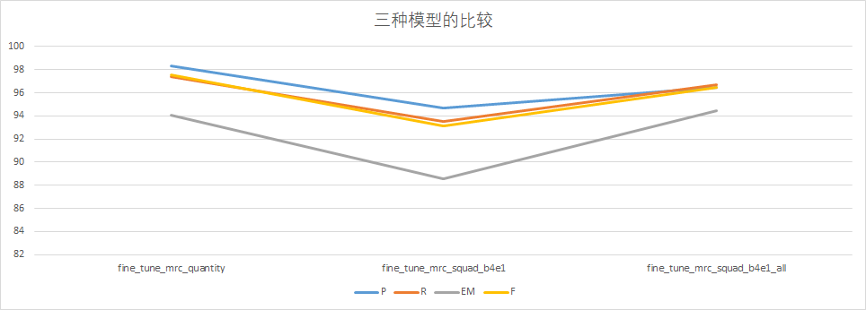

# quantity_extraction_and_understanding

A project to extract the meaningful quantity in medical area and understand the reference of quantity

### 1.基于bert的无微调结果

（肯定不行，bert先验不能回答问题，相当于纯蒙）--没必要放上去,但是可以作为无监督的base起点对比

    ***** eval metrics *****
    eval_P           = 1.8565
    eval_R           = 5.4526
    eval_exact_match =    0.0
    eval_f1          = 2.3776
    eval_samples     =    559

### 2.基于共指（只选择了预指和回指）的无微调结果：

（共指消解），数据集是ontonotes-release-5.0

共指的理解还是太单一了

该数据集可能涉及到版权问题，北大是否有版权使用？

（后续还需要进一步验证该过程，prompt不一致）

    ***** eval metrics *****
    eval_P           = 54.5677
    eval_R           = 55.2119
    eval_exact_match = 37.8723
    eval_f1          = 50.9436
    eval_samples     =     560

### 3.Roberta_base（较少mrc）--不及共指的效果

……不断加大MRC的数据集（//换用不同的MRC来做，等效于我换了不同的数据集--具体数据体量在github上搜一下）

    ***** eval metrics *****
    eval_P           =  36.186
    eval_R           = 33.7209
    eval_exact_match = 22.9787
    eval_f1          = 33.4211
    eval_samples     =     559

### 4.roberta_wwm（最多的mrc

（MRC的终点） 基于MRC的无微调结果（带重复数值解决方案-

    ***** eval metrics *****
    eval_P           = 71.4912
    eval_R           = 80.3706
    eval_exact_match = 56.5957
    eval_f1          = 71.5788
    eval_samples     =     560

（注意：在1.1的评价体系下不要带为空的list）

### 5.macbert_large

（这两个都是比较多的，是相同的数据体量，不同的架构） 最后还是保留roberta_wwm

    ***** eval metrics *****
    eval_P           = 72.3288
    eval_R           = 80.4419
    eval_exact_match =  53.617
    eval_f1          =  71.503
    eval_samples     =     559

(小bug，不能把无监督的时候no answer放进来，无监督的时候no answer特别多)
当时设置成[] in answer，无答案直接标成1的f值了，导致虚高

### 最后还是选择策略，让模型尽可能说出答案

无监督对比曲线：

说明，基于MRC的方法，无监督就能够把数值的指向说得大差不差了，只是一些表述可能不全面

往往是：比如说患高血压4年，然后抽取出高血压，患字抽不出来，但是我准备的标准答案是带有患字的

因解便血，抽取出解便血；

评估MRC好不好，就拿上次讨论班习近平那个例子来测试，初始测试+对抗测试（自己的小想法）

prompt选取，T5 trick(选取一下)

目前只能人造

重复数值解决： 4种方案，在所有工作调优，调整到最优以后，对比4种方案

划分好的eval太难了，简单的都拿去训练了，后面看看怎么调一下 注意公平比较，我后半段选取的eval是比较难的数据集？？？ 那怎么样才能公平比较呢？ 国新那边能否提供1~2条数据作为我的evaluation 本身还是很难的

## 有监督部分

选取前面F值表现最好的模型Roberta_wwm进行fine-tune

### 1.fair comparison的微调起点

之前无监督部分的数据集划分成了两部分，一部分用于train，一部分用于eval

选的样本相对平均水平更难一些（相对来说，训练的样本是里面简单的，验证的是更难的）

    ***** eval metrics *****
    eval_P           =  59.171(注意：所有步平均的PR算出来不是和平均的F在计算公式上一致的)
    eval_R           = 59.4417
    eval_exact_match = 41.3793
    eval_f1          = 56.4711
    eval_samples     =      50

因为是两个核，batch相当于是乘2的

### 2.batch size=4 epoch=1

    ***** eval metrics *****
    epoch            =     1.0
    eval_P           = 83.5617
    eval_R           = 91.2931
    eval_exact_match = 72.4138
    eval_f1          = 84.7048
    eval_samples     =      50

### 3.batch size=8 epoch=1

    ***** eval metrics *****
    epoch            =     1.0
    eval_P           = 84.0805
    eval_R           =  89.569
    eval_exact_match = 68.9655
    eval_f1          = 84.9343
    eval_samples     =      50

### 4.batch size=4 epoch=2

    ***** eval metrics *****
    epoch            =     2.0
    eval_P           = 84.9138
    eval_R           = 85.0123
    eval_exact_match = 68.9655
    eval_f1          = 83.8218
    eval_samples     =      50

### 5.batch size=8 epoch=2

    ***** eval metrics *****
    epoch            =     2.0
    eval_P           = 77.8448
    eval_R           = 80.8251
    eval_exact_match =  62.069
    eval_f1          = 77.2701
    eval_samples     =      50

### 6.batch size=4 epoch=3

    ***** eval metrics *****
    epoch            =     3.0
    eval_P           = 77.4904
    eval_R           = 79.7783
    eval_exact_match = 68.9655
    eval_f1          = 77.8803
    eval_samples     =      50

### 7.batch size=8 epoch=3

    ***** eval metrics *****
    epoch            =     3.0
    eval_P           = 78.3621
    eval_R           = 82.3276
    eval_exact_match = 65.5172
    eval_f1          = 79.5115
    eval_samples     =      50

### 8.batch size=8 epoch=10

    ***** eval metrics *****
    epoch            =    10.0
    eval_P           = 77.2686
    eval_R           = 82.6355
    eval_exact_match = 68.9655
    eval_f1          = 78.2393
    eval_samples     =      50

有监督实验总结：

分析：由于自己的训练样本真的太少了，自己的训练策略也比较一般，如果单一的数据训练多了，就容易导致过拟合/数据遗忘之前的知识，导致随着轮数的增加，效果反而不行了

几件事情：

1.目前的条件还不允许做，不可回答问题，去理解无效数值（可以写成一些思想，如果有更多的数据集，或者在fine-tune结束以后再看看支持2.0的情况

2.基线base差不多了，拿base去造大量的数据（虽然有错的部分，但是错的只是小部分），大量数据作为hasAns，混和上人工添加的一部分no answer（难以用规则覆盖上游 不抽取）

## tips：

如果做1.1版本的话

run_qa里面的metric修改为squad，改import；修改data 2.0->1.1（也许不用）

前面的无监督的结果，是拿2.0做的，就会导致

原本尽力说答案会说出来，但是强行转no answer了，从而使得准确率大幅度下降

拿fine-tune过一轮的结果去重新跑之前的项目

具体结果在result/out_after_fine-tune.txt

## 关于token的实验验证和思考：

第一个样本

    Original str: 1.患者，男性，86岁；2.因“反复便血11月，再发伴乏力3月，腹胀4天。
    Original len: 37
    [101, 122, 119, 2642, 5442, 8024, 4511, 2595, 8024, 8352, 2259, 8039, 123, 119, 1728, 100, 1353, 1908, 912, 6117, 8111, 3299, 8024, 1086, 1355, 845, 726, 1213, 124, 3299, 8024, 5592, 5515, 125, 1921, 511, 102]
    After tokenizer len: 37
    ['[CLS]', '1.', '患', '者', '，', '男', '性', '，', '86', '岁', '；', '2.', '因', '[UNK]', '反', '复', '便', '血', '11', '月', '，', '再', '发', '伴', '乏', '力', '3', '月', '，', '腹', '胀', '4', '天', '。', '[SEP]']
    Original str: 1.患者，男性，86岁；2.因“反复便血11月，再发伴乏力3月，腹胀4天。
    Original len: 37
    [101, 122, 119, 2642, 5442, 8024, 4511, 2595, 8024, 8352, 2259, 8039, 123, 119, 1728, 100, 1353, 1908, 912, 6117, 8111, 3299, 8024, 1086, 1355, 845, 726, 1213, 124, 3299, 8024, 5592, 5515, 125, 1921, 511, 102]
    After tokenizer len: 37
    ['[CLS]', '1.', '患', '者', '，', '男', '性', '，', '86', '岁', '；', '2.', '因', '[UNK]', '反', '复', '便', '血', '11', '月', '，', '再', '发', '伴', '乏', '力', '3', '月', '，', '腹', '胀', '4', '天', '。', '[SEP]']

两个模型的tokenizer基本都没有什么问题

第二个样本：

    Original str: 患者徐妹仙，女，63岁。因 确诊直肠癌11月余 门诊拟直肠癌收入院。入院查体：T36.8℃，P67次/分，R19次/分，BP126/64mmHg
    Original len: 72
    [101, 2642, 5442, 2528, 1987, 803, 8024, 1957, 8024, 8381, 2259, 511, 1728, 4802, 6402, 4684, 5499, 4617, 8111, 3299, 865, 7305, 6402, 2877, 4684, 5499, 4617, 3119, 1057, 7368, 511, 1057, 7368, 3389, 860, 8038, 11291, 8158, 119, 129, 8320, 8024, 158, 9411, 3613, 120, 1146, 8024, 12026, 8160, 3613, 120, 1146, 8024, 12203, 8455, 8158, 120, 8308, 8278, 12207, 102]
    After tokenizer len: 62
    ['[CLS]', '患', '者', '徐', '妹', '仙', '，', '女', '，', '63', '岁', '。', '因', '确', '诊', '直', '肠', '癌', '11', '月', '余', '门', '诊', '拟', '直', '肠', '癌', '收', '入', '院', '。', '入', '院', '查', '体', '：', 't36.', '8℃', '，', 'p67', '次', '/', '分', '，', 'r19', '次', '/', '分', '，', 'bp126', '/', '64mmhg', '[SEP]']
    Original str: 患者徐妹仙，女，63岁。因 确诊直肠癌11月余 门诊拟直肠癌收入院。入院查体：T36.8℃，P67次/分，R19次/分，BP126/64mmHg
    Original len: 72
    [101, 2642, 5442, 2528, 1987, 803, 8024, 1957, 8024, 8381, 2259, 511, 1728, 4802, 6402, 4684, 5499, 4617, 8111, 3299, 865, 7305, 6402, 2877, 4684, 5499, 4617, 3119, 1057, 7368, 511, 1057, 7368, 3389, 860, 8038, 100, 119, 129, 8320, 8024, 100, 3613, 120, 1146, 8024, 100, 3613, 120, 1146, 8024, 100, 120, 100, 102]
    After tokenizer len: 55
    ['[CLS]', '患', '者', '徐', '妹', '仙', '，', '女', '，', '63', '岁', '。', '因', '确', '诊', '直', '肠', '癌', '11', '月', '余', '门', '诊', '拟', '直', '肠', '癌', '收', '入', '院', '。', '入', '院', '查', '体', '：', '[UNK].', '8℃', '，', '[UNK]', '次', '/', '分', '，', '[UNK]', '次', '/', '分', '，', '[UNK]', '/', '[UNK]', '[SEP]']

但是在这里就能明显看出，bert-chinese对于英文字母+数字的处理情况

尤其是bert_base_chinese有很多token在embedding的时候变成了unk，甚至包含了部分数字，这也是导致模型输出不对的问题所在

也有一些输入并不是我们所想的格式，例如T36.和8分开了,出现p67，r19等问题，在这些比较新的模型中会按照子词的方式去处理，但处理成的子词，并不一定是我们所期望的划分

这种错误的分字方式，也会导致后续的分析无法准确

例如：当我们提问36.8度指的是什么的时候，原文只有T36. 8两个token，那模型的输出就会自然而然地输出T36，这也就是之前为什么有很多bug存在的情况

（了解了这种情况以后，再去思考怎么解决中文里面出现英文，并很好地指向英文的情况

引入更多的预训练模型来对比，思考最佳的预训练选择，以及解决方案：

每一组依次是MRC，bert_base，多语言bert，以及MRC的bert

    ['[CLS]', '1.', '患', '者', '，', '男', '性', '，', '86', '岁', '；', '2.', '因', '[UNK]', '反', '复', '便', '血', '11', '月', '，', '再', '发', '伴', '乏', '力', '3', '月', '，', '腹', '胀', '4', '天', '。', '[SEP]']
    ['[CLS]', '1.', '患', '者', '，', '男', '性', '，', '86', '岁', '；', '2.', '因', '[UNK]', '反', '复', '便', '血', '11', '月', '，', '再', '发', '伴', '乏', '力', '3', '月', '，', '腹', '胀', '4', '天', '。', '[SEP]']
    ['[CLS]', '1.', '患', '者', '，', '男', '性', '，', '86', '岁', '；', '2.', '因', '[UNK]', '反', '复', '便', '血', '11', '月', '，', '再', '发', '伴', '乏', '力', '3', '月', '，', '腹', '胀', '4', '天', '。', '[SEP]']
    ['[CLS]', '1.', '患', '者', '，', '男', '性', '，', '86', '岁', '；', '2.', '因', '[UNK]', '反', '复', '便', '血', '11', '月', '，', '再', '发', '伴', '乏', '力', '3', '月', '，', '腹', '胀', '4', '天', '。', '[SEP]']
    
    ['[CLS]', '患', '者', '徐', '妹', '仙', '，', '女', '，', '63', '岁', '。', '因', '确', '诊', '直', '肠', '癌', '11', '月', '余', '门', '诊', '拟', '直', '肠', '癌', '收', '入', '院', '。', '入', '院', '查', '体', '：', 't36.', '8℃', '，', 'p67', '次', '/', '分', '，', 'r19', '次', '/', '分', '，', 'bp126', '/', '64mmhg', '[SEP]']
    ['[CLS]', '患', '者', '徐', '妹', '仙', '，', '女', '，', '63', '岁', '。', '因', '确', '诊', '直', '肠', '癌', '11', '月', '余', '门', '诊', '拟', '直', '肠', '癌', '收', '入', '院', '。', '入', '院', '查', '体', '：', '[UNK].', '8℃', '，', '[UNK]', '次', '/', '分', '，', '[UNK]', '次', '/', '分', '，', '[UNK]', '/', '[UNK]', '[SEP]']
    ['[CLS]', '患', '者', '徐', '妹', '仙', '，', '女', '，', '63', '岁', '。', '因', '确', '诊', '直', '肠', '癌', '11', '月', '余', '门', '诊', '拟', '直', '肠', '癌', '收', '入', '院', '。', '入', '院', '查', '体', '：', 'T36.', '8℃', '，', 'P67', '次', '/', '分', '，', 'R19', '次', '/', '分', '，', 'BP126', '/', '64mmHg', '[SEP]']
    ['[CLS]', '患', '者', '徐', '妹', '仙', '，', '女', '，', '63', '岁', '。', '因', '确', '诊', '直', '肠', '癌', '11', '月', '余', '门', '诊', '拟', '直', '肠', '癌', '收', '入', '院', '。', '入', '院', '查', '体', '：', 't36.', '8℃', '，', 'p67', '次', '/', '分', '，', 'r19', '次', '/', '分', '，', 'bp126', '/', '64mmhg', '[SEP]']
    
    ['[CLS]', '谷', '草', '转', '氨', '酶', '(', 'ast', ')', '16.', '6iu', '/', 'l,', '钾', '(', 'k', '+', ')', '3.', '64mmol', '/', 'l,', '钠', '(', 'na', '+', ')', '142.', '6mmol', '/', 'l,', '磷', '(', 'phos', ')', '1.', '24mmol', '/', 'l,', '[SEP]']
    ['[CLS]', '谷', '草', '转', '氨', '酶', '(', '[UNK]', ')', '16.', '[UNK]', '/', '[UNK],', '钾', '(', '[UNK]', '+', ')', '3.', '64mmol', '/', '[UNK],', '钠', '(', '[UNK]', '+', ')', '142.', '6mmol', '/', '[UNK],', '磷', '(', '[UNK]', ')', '1.', '24mmol', '/', '[UNK],', '[SEP]']
    ['[CLS]', '谷', '草', '转', '氨', '酶', '(', 'AST', ')', '16.', '6IU', '/', 'L,', '钾', '(', 'K', '+', ')', '3.', '64mmol', '/', 'L,', '钠', '(', 'Na', '+', ')', '142.', '6mmol', '/', 'L,', '磷', '(', 'PHOS', ')', '1.', '24mmol', '/', 'L,', '[SEP]']
    ['[CLS]', '谷', '草', '转', '氨', '酶', '(', 'ast', ')', '16.', '6iu', '/', 'l,', '钾', '(', 'k', '+', ')', '3.', '64mmol', '/', 'l,', '钠', '(', 'na', '+', ')', '142.', '6mmol', '/', 'l,', '磷', '(', 'phos', ')', '1.', '24mmol', '/', 'l,', '[SEP]']

分析不难看出，最差的是bert-base，对于英文的处理几乎没有，稍微有一点点字母就会把连带的一些都设置成unk

然后是新版本的这些bert，加入了一些对英文字母的处理

还能接受，但是不够好

    t30mg
    [101, 11291, 13079, 8181, 102]
    ['[CLS]', 't30mg', '[SEP]']
    拆解出来是t3 ##0m ##g这样的子词形式，这样也就能够解释，为什么我们对T37度进行提问的时候会返回T3了

    [101, 162, 8114, 9404, 102]
    ['[CLS]', 't', '30', 'mg', '[SEP]']
    拆解出来是t 30 mg

### 写在专利中的内容

1. 中英文混合的tokenizer过程

在医学文本当中含有较多的英文字母表述。例如，“T37°C”表示体温37度；“剂量：33mg”当中的“mg”是一个度量剂量的单位；“直径3mm”当中的“mm”是一个度量长度的单位；在后续的BERT-MRC问答方法当中，需要用到BertTokenizer。中文tokenizer是以字符级别进行的tokenize，但是当遇到英文字母和数字时会得到下面的结果：

|  子词划分情况   | 对应索引                           |分词结果|
|  ----  |--------------------------------|----  |
| t3##7##°c  | [101, 11291, 8161, 9953, 102]  |['[CLS]', 't37°c', '[SEP]']|
| 3m##g  | [101, 9192, 8181, 102]         |['[CLS]', '3mg', '[SEP]']|
|3mm    | [101, 12064, 102]              |['[CLS]', '3mm', '[SEP]']|

这样的分词方式使得下游模型不能准确地理解T 37°C，3 mg和3 mm。 当进行提问“T37°C指的是？”时，无论怎么进行模型训练，模型的输出都只能是[T3,7,°c, T37°C, T37, 7°C, T37°C]

其中的一个或者很长的表述，显然不是我们所预期的结果。 因此考虑在预处理的过程中，在英文和数字之间加入空格修正，以达到正确地分词方式。

|  子词划分情况   | 对应索引                          |分词结果|
|  ----  |-------------------------------|----  |
| t、37##°c  |   [101, 162, 8234, 9953, 102] |    ['[CLS]', 't', '37°c', '[SEP]'] |
|3、mg   | [101, 124, 9404, 102]  |  ['[CLS]', '3', 'mg', '[SEP]']|
|3、mm   | [101, 124, 8595, 102]   | ['[CLS]', '3', 'mm', '[SEP]']|

## 从分词的角度对文本需要做一些预处理(处理中文文本中会遇到的英文字母问题)

1.英文字母紧跟数字的情况，两者之间需要加入空格/标点符号 2.数字+英文单位的情况，需要把数字和单位之间引入一个空格
考虑这个并不会影响我们的语法树，基于规则的抽取方法，因此将它作为文本预处理的一种函数，不论是train，eval，test，或是inference，都需要对文本做该预处理

修订后的一些对照情况：

    ['[CLS]', '1.', '患', '者', '，', '男', '性', '，', '86', '岁', '；', '2.', '因', '[UNK]', '反', '复', '便', '血', '11', '月', '，', '再', '发', '伴', '乏', '力', '3', '月', '，', '腹', '胀', '4', '天', '。', '[SEP]']
    ['[CLS]', '1.', '患', '者', '，', '男', '性', '，', '86', '岁', '；', '2.', '因', '[UNK]', '反', '复', '便', '血', '11', '月', '，', '再', '发', '伴', '乏', '力', '3', '月', '，', '腹', '胀', '4', '天', '。', '[SEP]']
    ['[CLS]', '1.', '患', '者', '，', '男', '性', '，', '86', '岁', '；', '2.', '因', '[UNK]', '反', '复', '便', '血', '11', '月', '，', '再', '发', '伴', '乏', '力', '3', '月', '，', '腹', '胀', '4', '天', '。', '[SEP]']
    ['[CLS]', '1.', '患', '者', '，', '男', '性', '，', '86', '岁', '；', '2.', '因', '[UNK]', '反', '复', '便', '血', '11', '月', '，', '再', '发', '伴', '乏', '力', '3', '月', '，', '腹', '胀', '4', '天', '。', '[SEP]']
    
    ['[CLS]', '患', '者', '徐', '妹', '仙', '，', '女', '，', '63', '岁', '。', '因', '确', '诊', '直', '肠', '癌', '11', '月', '余', '门', '诊', '拟', '直', '肠', '癌', '收', '入', '院', '。', '入', '院', '查', '体', '：', 't', '：', '36.', '8℃', '，', 'p', '67', '次', '/', '分', '，', 'r', '19', '次', '/', '分', '，', 'bp', '126', '/', '64', 'mmhg', '[SEP]']
    ['[CLS]', '患', '者', '徐', '妹', '仙', '，', '女', '，', '63', '岁', '。', '因', '确', '诊', '直', '肠', '癌', '11', '月', '余', '门', '诊', '拟', '直', '肠', '癌', '收', '入', '院', '。', '入', '院', '查', '体', '：', '[UNK]', '：', '36.', '8℃', '，', '[UNK]', '67', '次', '/', '分', '，', '[UNK]', '19', '次', '/', '分', '，', '[UNK]', '126', '/', '64', '[UNK]', '[SEP]']
    ['[CLS]', '患', '者', '徐', '妹', '仙', '，', '女', '，', '63', '岁', '。', '因', '确', '诊', '直', '肠', '癌', '11', '月', '余', '门', '诊', '拟', '直', '肠', '癌', '收', '入', '院', '。', '入', '院', '查', '体', '：', 'T', '：', '36.', '8℃', '，', 'P', '67', '次', '/', '分', '，', 'R', '19', '次', '/', '分', '，', 'BP', '126', '/', '64', 'mmHg', '[SEP]']
    ['[CLS]', '患', '者', '徐', '妹', '仙', '，', '女', '，', '63', '岁', '。', '因', '确', '诊', '直', '肠', '癌', '11', '月', '余', '门', '诊', '拟', '直', '肠', '癌', '收', '入', '院', '。', '入', '院', '查', '体', '：', 't', '：', '36.', '8℃', '，', 'p', '67', '次', '/', '分', '，', 'r', '19', '次', '/', '分', '，', 'bp', '126', '/', '64', 'mmhg', '[SEP]']
    
    ['[CLS]', '谷', '草', '转', '氨', '酶', '(', 'ast', ')', '16.', '6', 'iu', '/', 'l,', '钾', '(', 'k', '+', ')', '3.', '64', 'mmol', '/', 'l,', '钠', '(', 'na', '+', ')', '142.', '6', 'mmol', '/', 'l,', '磷', '(', 'phos', ')', '1.', '24', 'mmol', '/', 'l,', '剂', '量', '为', '30mg', '每', '天', '[SEP]']
    ['[CLS]', '谷', '草', '转', '氨', '酶', '(', '[UNK]', ')', '16.', '6', '[UNK]', '/', '[UNK],', '钾', '(', '[UNK]', '+', ')', '3.', '64', 'mmol', '/', '[UNK],', '钠', '(', '[UNK]', '+', ')', '142.', '6', 'mmol', '/', '[UNK],', '磷', '(', '[UNK]', ')', '1.', '24', 'mmol', '/', '[UNK],', '剂', '量', '为', '30mg', '每', '天', '[SEP]']
    ['[CLS]', '谷', '草', '转', '氨', '酶', '(', 'AST', ')', '16.', '6', 'IU', '/', 'L,', '钾', '(', 'K', '+', ')', '3.', '64', 'mmol', '/', 'L,', '钠', '(', 'Na', '+', ')', '142.', '6', 'mmol', '/', 'L,', '磷', '(', 'PHOS', ')', '1.', '24', 'mmol', '/', 'L,', '剂', '量', '为', '30mg', '每', '天', '[SEP]']
    ['[CLS]', '谷', '草', '转', '氨', '酶', '(', 'ast', ')', '16.', '6', 'iu', '/', 'l,', '钾', '(', 'k', '+', ')', '3.', '64', 'mmol', '/', 'l,', '钠', '(', 'na', '+', ')', '142.', '6', 'mmol', '/', 'l,', '磷', '(', 'phos', ')', '1.', '24', 'mmol', '/', 'l,', '剂', '量', '为', '30mg', '每', '天', '[SEP]']

### 重新tokenizer后重复上面的实验

### 1.基于bert的无微调结果

    ***** eval metrics *****
    eval_P           = 1.8353
    eval_R           = 5.3909
    eval_exact_match =    0.0
    eval_f1          = 2.2203
    eval_samples     =    601

### 2.基于共指（只选择了预指和回指）的无微调结果：

    ***** eval metrics *****
    eval_P           = 31.3643
    eval_R           = 31.7751
    eval_exact_match = 21.2598
    eval_f1          = 29.5961
    eval_samples     =     625

### 3.Roberta_base（较少mrc）--不及共指的效果

    ***** eval metrics *****
    eval_P           = 36.2996
    eval_R           = 33.0869
    eval_exact_match = 24.0157
    eval_f1          = 33.0175
    eval_samples     =     601

### 4.roberta_wwm（最多的mrc

    ***** eval metrics *****
    eval_P           = 74.2892
    eval_R           = 83.6246
    eval_exact_match =  57.874
    eval_f1          = 74.6617
    eval_samples     =     625

### 5.macbert_large

    ***** eval metrics *****
    eval_P           = 75.2786
    eval_R           = 80.6075
    eval_exact_match = 55.1181
    eval_f1          = 72.8294
    eval_samples     =     601

新的结果，最好的模型，有小幅度提升，就是那些英文的

### Supervise(有了之前的经验，就直接fine-tune了一轮)

start_point还是一样的

    ***** eval metrics *****
    epoch            =     1.0
    eval_P           = 89.2241
    eval_R           = 86.2685
    eval_exact_match = 82.7586
    eval_f1          = 86.6379
    eval_samples     =      50

分析就是解决了之前token分词不对的问题

### 现阶段得到三个模型：

    fine_tune_mrc_quantity 最初基于原来的分词方法+train样本训练得到的
    fine_tune_mrc_squad_b4e1 利用新的分词方法+train样本训练得到的
    fine_tune_mrc_squad_b4e1_all 利用新的分词方法+train+eval训练样本得到的

由于新的分词方法理论上是更好的，因此在这一轮做eval的时候不考虑旧的分词策略

将新的分词策略直接eval

三个结果：

    fine_tune_mrc_quantity{
        "eval_P": 98.35958005249344,
        "eval_R": 97.3612673415823,
        "eval_exact_match": 94.09448818897638,
        "eval_f1": 97.5561828167201,
        "eval_samples": 625
    }

    fine_tune_mrc_squad_b4e1{
        "eval_P": 94.68789227433527,
        "eval_R": 93.4911190078513,
        "eval_exact_match": 88.58267716535433,
        "eval_f1": 93.15098263317955,
        "eval_samples": 625
    }

    fine_tune_mrc_squad_b4e1_all{
        "eval_P": 96.46137982752157,
        "eval_R": 96.73228346456693,
        "eval_exact_match": 94.48818897637796,
        "eval_f1": 96.47234770787341,
        "eval_samples": 625
    }

理论上用了新的方法，对应原来相同体量的数据进行fine-tune，其结果应该更好

但实际上没有

1~2之间，下滑；从token的角度来看，之前分词错误的情况下，部分数据没有参与到fine-tune的过程中

也就是说，实际有效的训练数据比喂进去的更小

而从2~3之间，正常上升，说明是过拟合导致的；但是它自己都不能对应自己达到100%，说明在训练过程中产生在训练到某个局部时过拟合/欠拟合的问题

分析eval_predictions.json

确实后两个的输出也并不如第一个好

### 说明的确还是需要用主动学习的范式

首先基于最开始的预训练

然后，inference出低score和回答错误的样本

然后把这些拿进去fine-tune

而不是一股脑都扔进去训练
