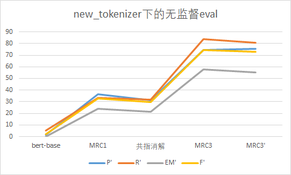
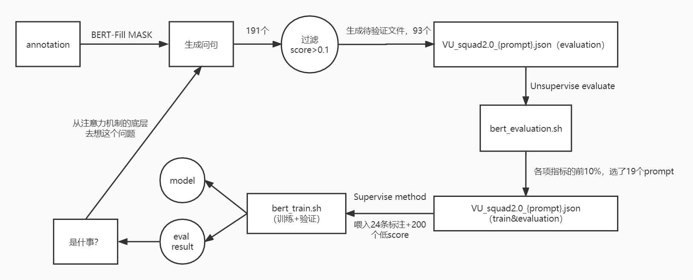

# 已申请专利

转载请注明出处，如需合作请联系zengxiaodong@stu.pku.edu.cn

基于小样本的医疗数值抽取和理解方法及装置

专利类型： 发明公开

申请(专利)号： CN202210221233.9申请日： 2022-03-09

申请公布号： CN114357144A公开公告日： 2022-04-15

申请人： 北京大学

地址： 100871 北京市海淀区颐和园路5号

发明人： 胡文蕙; 刘学洋; 曾晓东

专辑： 工程科技Ⅱ辑

专题： 电力工业

分类号： G06F16/332;G06F40/216;G06K9/62;G16H50/70;G06F40/289

主分类号： G06F16/332国省代码： 11

页数： 22

代理机构： 北京路浩知识产权代理有限公司代理人： 郭亮

## 主要业务合作

与北京大学医学部公共卫生学院合作完成北京多家医院病人数据的数据治理

业务输入为：一段病人查房记录，其中包含一些病人的病情信息，包含症状实体，疾病实体，各项指标实体

医学部主诉分析需求为提取非结构化文本数据当中的指标信息，抽取其中的指标类数值，服务于下游预测分析

常见的指标类数值包含：

1.基本带数字和单位的指标

2.纯数字的比值类的指标

3.+—号等说明阴阳性的指标

并将指标链接到对应的度量对象、时间、和所属大类别的检查项目

输入输出样例：

    {
      "原文": "  2016-09-1009:58:46院内会诊记录单  姓名：***性别：女年龄：62岁科室：中西医结合科床号：112住院号：***  病历摘要及请求会诊的目的和要求：  患者目前考虑干燥综合征可能性大，请贵科会诊完善干眼症等相关检查。敬邀！  特请科室：眼科医生：科室会诊  请会诊医师：***,中西医结合科  请会诊日期：2016-9-98:40:42  会诊医师意见：  病史敬悉。患者诉干眼病史。查体：右0.8，左0.2，双眼角膜明，BUT下降，前房中深，瞳孔直径3mm，光敏，眼底网膜色淡红。辅助检查：泪液分泌实验：右3mm，左2mm。医学验光：右0.9，左0.8。眼压双眼15mmHg。B超：双眼玻璃体轻混。OCT未见明显异常。VEP：左眼幅值稍低。ERG双眼幅值稍低。会诊考虑双眼干眼症；双眼屈光不正。建议：玻璃酸钠眼液，点双眼，4次/日；注意休息；我科密切随访，谢邀！  会诊医师：***，眼科  会诊日期：2016-9-911:24:33-->",
      "result": [
        {
          "数值": "62",
          "单位": "岁",
          "指标名": "年龄",
          "可信度": "0.9788012504577637",
          "时间": "2016-09-10",
          "所属检查项目": ""
        },
        {
          "数值": "3",
          "单位": "mm",
          "指标名": "瞳孔直径",
          "可信度": "0.9994403123855591",
          "时间": "2016-09-10",
          "所属检查项目": "查体"
        },
        {
          "数值": "0.8",
          "单位": "",
          "指标名": "右眼视力",
          "可信度": "0.99954754114151",
          "时间": "2016-09-10",
          "所属检查项目": "查体"
        },
        {
          "数值": "0.2",
          "单位": "",
          "指标名": "左眼视力",
          "可信度": "0.9990530014038086",
          "时间": "2016-09-10",
          "所属检查项目": "查体"
        },
        {
          "数值": "3",
          "单位": "mm",
          "指标名": "右",
          "可信度": "0.8601629734039307",
          "时间": "2016-09-10",
          "所属检查项目": "泪液分泌实验"
        },
        {
          "数值": "2",
          "单位": "mm",
          "指标名": "左",
          "可信度": "0.885072648525238",
          "时间": "2016-09-10",
          "所属检查项目": "泪液分泌实验"
        },
        {
          "数值": "0.9",
          "单位": "",
          "指标名": "右眼视力",
          "可信度": "0.9916517734527588",
          "时间": "2016-09-10",
          "所属检查项目": "医学验光"
        },
        {
          "数值": "0.8",
          "单位": "",
          "指标名": "左眼视力",
          "可信度": "0.9902620315551758",
          "时间": "2016-09-10",
          "所属检查项目": "医学验光"
        },
        {
          "数值": "15",
          "单位": "mmHg",
          "指标名": "眼压双眼",
          "可信度": "0.564716100692749",
          "时间": "2016-09-10",
          "所属检查项目": ""
        },
        {
          "数值": "4",
          "单位": "次",
          "指标名": "玻璃酸钠眼液",
          "可信度": "0.4852046072483063",
          "时间": "2016-09-10",
          "所属检查项目": "建议"
        }
      ]
    }

# quantity_extraction_and_understanding

A project to extract the meaningful quantity in medical area and understand the reference of quantity

首先使用data下的 `VU_squad2.0_train.json` 进行训练

选取`bert-base-chinese`、`bert-base-multilingual-cased`、`chinese-bert-wwm`三种模型结构进行训练

    #!/bin/bash
 
    for i in ./chinese-roberta-wwm-ext-large ./chinese-bert-wwm ./bert-base-chinese ./bert-base-multilingual-cased ;
    do
    echo $i is appoint ;
    python run_qa.py \
      --model_name_or_path $i \
      --train_file ./data/VU_squad2.0_train.json \
      --validation_file ./data/VU_squad2.0_validate.json \
      --do_train \
      --do_eval\
      --per_device_train_batch_size 6 \
      --learning_rate 3e-5 \
      --num_train_epochs 2 \
      --max_seq_length 512 \
      --doc_stride 128 \
      --output_dir ./fine_tune_mrc_squad_$i/
    done

bert-base-chinese

bert-base-multilingual-cased

chinese-bert-wwm

chinese-roberta-wwm-ext-large

以上效果都不佳

`考虑通过小样本学习来进一步提升，而不是使用更多的标注数据`，进行了如下实验与探索

最后通过模型蒸馏的形式，将大模型好的理解能力用一个小模型实现，以节约机器和推理开销

### 1.基于bert Unsupervise的结果

作为无监督的base起点对比，对比middle task对最终结果的提升程度

    ***** eval metrics *****
    eval_P           = 1.8565
    eval_R           = 5.4526
    eval_exact_match =    0.0
    eval_f1          = 2.3776
    eval_samples     =    559

### 2.共指消解数据集作为middle task的无微调结果：

数据集是ontonotes-release-5.0

设计这个middle task的想法是：

分析具体问题场景时，数值抽取主要包含两种形式：

数值在前面：

8%的病人病情不容乐观->8% 病人病情

数值在后面：

病人的体温为37度->37度 体温

将数值和指标看做是共指消解中的`预指`和`回指`

    ***** eval metrics *****
    eval_P           = 54.5677
    eval_R           = 55.2119
    eval_exact_match = 37.8723
    eval_f1          = 50.9436
    eval_samples     =     560

### 3.少量dureader作为middle task的无微调结果

    ***** eval metrics *****
    eval_P           =  36.186
    eval_R           = 33.7209
    eval_exact_match = 22.9787
    eval_f1          = 33.4211
    eval_samples     =     559

### 4.全量dureader作为middle task的无微调结果

    ***** eval metrics *****
    eval_P           = 71.4912
    eval_R           = 80.3706
    eval_exact_match = 56.5957
    eval_f1          = 71.5788
    eval_samples     =     560

（注意：在1.1的评价体系下不要带为空的list，SQuAD1.1不含无回答的情况） 分词由空格改成jieba分词

### 5.全量dureader+共指消解作为middle task的无微调结果

    ***** eval metrics *****
    eval_P           = 72.3288
    eval_R           = 80.4419
    eval_exact_match =  53.617
    eval_f1          =  71.503
    eval_samples     =     559

## 最后选择策略：让模型尽可能说出答案

不设置不可回答模式，当无答案存在时，P第二的answer将作为回答，但其score值较低

可以根据需要，按score进行修正

## 无监督对比曲线：

## Supervise method

选取前面F值表现最好的模型和策略，进行fine-tune

`就像选择优生进入北大清华进一步培养一样`

### 1.fair comparison的微调起点

把之前无监督部分的数据集划分成了两部分，一部分用于train，一部分用于eval

选的样本相对平均水平更难一些（相对来说，训练的样本是里面简单的，验证的是更难的）

    ***** eval metrics *****
    eval_P           =  59.171(注意：所有步平均的PR算出来不是和平均的F在计算公式上一致的)
    eval_R           = 59.4417
    eval_exact_match = 41.3793
    eval_f1          = 56.4711
    eval_samples     =      50

### 2.batch size=4 epoch=1

    ***** eval metrics *****
    epoch            =     1.0
    eval_P           = 83.5617
    eval_R           = 91.2931
    eval_exact_match = 72.4138
    eval_f1          = 84.7048
    eval_samples     =      50

### 3.batch size=8 epoch=1

    ***** eval metrics *****
    epoch            =     1.0
    eval_P           = 84.0805
    eval_R           =  89.569
    eval_exact_match = 68.9655
    eval_f1          = 84.9343
    eval_samples     =      50

### 4.batch size=4 epoch=2

    ***** eval metrics *****
    epoch            =     2.0
    eval_P           = 84.9138
    eval_R           = 85.0123
    eval_exact_match = 68.9655
    eval_f1          = 83.8218
    eval_samples     =      50

### 5.batch size=8 epoch=2

    ***** eval metrics *****
    epoch            =     2.0
    eval_P           = 77.8448
    eval_R           = 80.8251
    eval_exact_match =  62.069
    eval_f1          = 77.2701
    eval_samples     =      50

### 6.batch size=4 epoch=3

    ***** eval metrics *****
    epoch            =     3.0
    eval_P           = 77.4904
    eval_R           = 79.7783
    eval_exact_match = 68.9655
    eval_f1          = 77.8803
    eval_samples     =      50

### 7.batch size=8 epoch=3

    ***** eval metrics *****
    epoch            =     3.0
    eval_P           = 78.3621
    eval_R           = 82.3276
    eval_exact_match = 65.5172
    eval_f1          = 79.5115
    eval_samples     =      50

### 8.batch size=8 epoch=10

    ***** eval metrics *****
    epoch            =    10.0
    eval_P           = 77.2686
    eval_R           = 82.6355
    eval_exact_match = 68.9655
    eval_f1          = 78.2393
    eval_samples     =      50

## 有监督实验总结：

原本模型已经经过大量的middle task来进行训练，现阶段数值理解训练数据较少，多轮训练容易过拟合

但是单轮训练的表现已经很好了

### future todo list：

1.目前的条件还不允许做，不可回答问题，去理解无效数值（可以写成一些思想，如果有更多的数据集，或者在fine-tune结束以后再看看支持2.0的情况

2.基线base差不多了，拿base去造大量的数据（虽然有错的部分，但是错的只是小部分），大量数据作为hasAns，混和上人工添加的一部分no answer（难以用规则覆盖上游 不抽取）

## tips：

如果做1.1版本的话

run_qa里面的metric修改为squad，改import；修改data 2.0->1.1（也许不用）

前面的无监督的结果，是拿2.0做的，就会导致

原本尽力说答案会说出来，但是强行转no answer了，从而使得准确率大幅度下降

拿fine-tune过一轮的结果去重新跑之前的项目

具体结果在original_result/out_after_fine-tune.txt

## 关于token的实验验证和思考：

第一个样本

    Original str: 1.患者，男性，86岁；2.因“反复便血11月，再发伴乏力3月，腹胀4天。
    Original len: 37
    [101, 122, 119, 2642, 5442, 8024, 4511, 2595, 8024, 8352, 2259, 8039, 123, 119, 1728, 100, 1353, 1908, 912, 6117, 8111, 3299, 8024, 1086, 1355, 845, 726, 1213, 124, 3299, 8024, 5592, 5515, 125, 1921, 511, 102]
    After tokenizer len: 37
    ['[CLS]', '1.', '患', '者', '，', '男', '性', '，', '86', '岁', '；', '2.', '因', '[UNK]', '反', '复', '便', '血', '11', '月', '，', '再', '发', '伴', '乏', '力', '3', '月', '，', '腹', '胀', '4', '天', '。', '[SEP]']
    Original str: 1.患者，男性，86岁；2.因“反复便血11月，再发伴乏力3月，腹胀4天。
    Original len: 37
    [101, 122, 119, 2642, 5442, 8024, 4511, 2595, 8024, 8352, 2259, 8039, 123, 119, 1728, 100, 1353, 1908, 912, 6117, 8111, 3299, 8024, 1086, 1355, 845, 726, 1213, 124, 3299, 8024, 5592, 5515, 125, 1921, 511, 102]
    After tokenizer len: 37
    ['[CLS]', '1.', '患', '者', '，', '男', '性', '，', '86', '岁', '；', '2.', '因', '[UNK]', '反', '复', '便', '血', '11', '月', '，', '再', '发', '伴', '乏', '力', '3', '月', '，', '腹', '胀', '4', '天', '。', '[SEP]']

两个模型的tokenizer基本都没有什么问题

第二个样本：

    Original str: 患者徐妹仙，女，63岁。因 确诊直肠癌11月余 门诊拟直肠癌收入院。入院查体：T36.8℃，P67次/分，R19次/分，BP126/64mmHg
    Original len: 72
    [101, 2642, 5442, 2528, 1987, 803, 8024, 1957, 8024, 8381, 2259, 511, 1728, 4802, 6402, 4684, 5499, 4617, 8111, 3299, 865, 7305, 6402, 2877, 4684, 5499, 4617, 3119, 1057, 7368, 511, 1057, 7368, 3389, 860, 8038, 11291, 8158, 119, 129, 8320, 8024, 158, 9411, 3613, 120, 1146, 8024, 12026, 8160, 3613, 120, 1146, 8024, 12203, 8455, 8158, 120, 8308, 8278, 12207, 102]
    After tokenizer len: 62
    ['[CLS]', '患', '者', '徐', '妹', '仙', '，', '女', '，', '63', '岁', '。', '因', '确', '诊', '直', '肠', '癌', '11', '月', '余', '门', '诊', '拟', '直', '肠', '癌', '收', '入', '院', '。', '入', '院', '查', '体', '：', 't36.', '8℃', '，', 'p67', '次', '/', '分', '，', 'r19', '次', '/', '分', '，', 'bp126', '/', '64mmhg', '[SEP]']
    Original str: 患者徐妹仙，女，63岁。因 确诊直肠癌11月余 门诊拟直肠癌收入院。入院查体：T36.8℃，P67次/分，R19次/分，BP126/64mmHg
    Original len: 72
    [101, 2642, 5442, 2528, 1987, 803, 8024, 1957, 8024, 8381, 2259, 511, 1728, 4802, 6402, 4684, 5499, 4617, 8111, 3299, 865, 7305, 6402, 2877, 4684, 5499, 4617, 3119, 1057, 7368, 511, 1057, 7368, 3389, 860, 8038, 100, 119, 129, 8320, 8024, 100, 3613, 120, 1146, 8024, 100, 3613, 120, 1146, 8024, 100, 120, 100, 102]
    After tokenizer len: 55
    ['[CLS]', '患', '者', '徐', '妹', '仙', '，', '女', '，', '63', '岁', '。', '因', '确', '诊', '直', '肠', '癌', '11', '月', '余', '门', '诊', '拟', '直', '肠', '癌', '收', '入', '院', '。', '入', '院', '查', '体', '：', '[UNK].', '8℃', '，', '[UNK]', '次', '/', '分', '，', '[UNK]', '次', '/', '分', '，', '[UNK]', '/', '[UNK]', '[SEP]']

但是在这里就能明显看出，bert-chinese对于英文字母+数字的处理情况

尤其是bert_base_chinese有很多token在embedding的时候变成了unk，甚至包含了部分数字，这也是导致模型输出不对的问题所在

也有一些输入并不是我们所想的格式，例如T36.和8分开了,出现p67，r19等问题，在这些比较新的模型中会按照子词的方式去处理，但处理成的子词，并不一定是我们所期望的划分

这种错误的分字方式，也会导致后续的分析无法准确

例如：当我们提问36.8度指的是什么的时候，原文只有T36. 8两个token，那模型的输出就会自然而然地输出T36，这也就是之前为什么有很多bug存在的情况

（了解了这种情况以后，再去思考怎么解决中文里面出现英文，并很好地指向英文的情况

引入更多的预训练模型来对比，思考最佳的预训练选择，以及解决方案：

每一组依次是MRC，bert_base，多语言bert，以及MRC的bert

    ['[CLS]', '1.', '患', '者', '，', '男', '性', '，', '86', '岁', '；', '2.', '因', '[UNK]', '反', '复', '便', '血', '11', '月', '，', '再', '发', '伴', '乏', '力', '3', '月', '，', '腹', '胀', '4', '天', '。', '[SEP]']
    ['[CLS]', '1.', '患', '者', '，', '男', '性', '，', '86', '岁', '；', '2.', '因', '[UNK]', '反', '复', '便', '血', '11', '月', '，', '再', '发', '伴', '乏', '力', '3', '月', '，', '腹', '胀', '4', '天', '。', '[SEP]']
    ['[CLS]', '1.', '患', '者', '，', '男', '性', '，', '86', '岁', '；', '2.', '因', '[UNK]', '反', '复', '便', '血', '11', '月', '，', '再', '发', '伴', '乏', '力', '3', '月', '，', '腹', '胀', '4', '天', '。', '[SEP]']
    ['[CLS]', '1.', '患', '者', '，', '男', '性', '，', '86', '岁', '；', '2.', '因', '[UNK]', '反', '复', '便', '血', '11', '月', '，', '再', '发', '伴', '乏', '力', '3', '月', '，', '腹', '胀', '4', '天', '。', '[SEP]']
    
    ['[CLS]', '患', '者', '徐', '妹', '仙', '，', '女', '，', '63', '岁', '。', '因', '确', '诊', '直', '肠', '癌', '11', '月', '余', '门', '诊', '拟', '直', '肠', '癌', '收', '入', '院', '。', '入', '院', '查', '体', '：', 't36.', '8℃', '，', 'p67', '次', '/', '分', '，', 'r19', '次', '/', '分', '，', 'bp126', '/', '64mmhg', '[SEP]']
    ['[CLS]', '患', '者', '徐', '妹', '仙', '，', '女', '，', '63', '岁', '。', '因', '确', '诊', '直', '肠', '癌', '11', '月', '余', '门', '诊', '拟', '直', '肠', '癌', '收', '入', '院', '。', '入', '院', '查', '体', '：', '[UNK].', '8℃', '，', '[UNK]', '次', '/', '分', '，', '[UNK]', '次', '/', '分', '，', '[UNK]', '/', '[UNK]', '[SEP]']
    ['[CLS]', '患', '者', '徐', '妹', '仙', '，', '女', '，', '63', '岁', '。', '因', '确', '诊', '直', '肠', '癌', '11', '月', '余', '门', '诊', '拟', '直', '肠', '癌', '收', '入', '院', '。', '入', '院', '查', '体', '：', 'T36.', '8℃', '，', 'P67', '次', '/', '分', '，', 'R19', '次', '/', '分', '，', 'BP126', '/', '64mmHg', '[SEP]']
    ['[CLS]', '患', '者', '徐', '妹', '仙', '，', '女', '，', '63', '岁', '。', '因', '确', '诊', '直', '肠', '癌', '11', '月', '余', '门', '诊', '拟', '直', '肠', '癌', '收', '入', '院', '。', '入', '院', '查', '体', '：', 't36.', '8℃', '，', 'p67', '次', '/', '分', '，', 'r19', '次', '/', '分', '，', 'bp126', '/', '64mmhg', '[SEP]']
    
    ['[CLS]', '谷', '草', '转', '氨', '酶', '(', 'ast', ')', '16.', '6iu', '/', 'l,', '钾', '(', 'k', '+', ')', '3.', '64mmol', '/', 'l,', '钠', '(', 'na', '+', ')', '142.', '6mmol', '/', 'l,', '磷', '(', 'phos', ')', '1.', '24mmol', '/', 'l,', '[SEP]']
    ['[CLS]', '谷', '草', '转', '氨', '酶', '(', '[UNK]', ')', '16.', '[UNK]', '/', '[UNK],', '钾', '(', '[UNK]', '+', ')', '3.', '64mmol', '/', '[UNK],', '钠', '(', '[UNK]', '+', ')', '142.', '6mmol', '/', '[UNK],', '磷', '(', '[UNK]', ')', '1.', '24mmol', '/', '[UNK],', '[SEP]']
    ['[CLS]', '谷', '草', '转', '氨', '酶', '(', 'AST', ')', '16.', '6IU', '/', 'L,', '钾', '(', 'K', '+', ')', '3.', '64mmol', '/', 'L,', '钠', '(', 'Na', '+', ')', '142.', '6mmol', '/', 'L,', '磷', '(', 'PHOS', ')', '1.', '24mmol', '/', 'L,', '[SEP]']
    ['[CLS]', '谷', '草', '转', '氨', '酶', '(', 'ast', ')', '16.', '6iu', '/', 'l,', '钾', '(', 'k', '+', ')', '3.', '64mmol', '/', 'l,', '钠', '(', 'na', '+', ')', '142.', '6mmol', '/', 'l,', '磷', '(', 'phos', ')', '1.', '24mmol', '/', 'l,', '[SEP]']

分析不难看出，最差的是bert-base，对于英文的处理几乎没有，稍微有一点点字母就会把连带的一些都设置成unk

然后是新版本的这些bert，加入了一些对英文字母的处理

还能接受，但是不够好

    t30mg
    [101, 11291, 13079, 8181, 102]
    ['[CLS]', 't30mg', '[SEP]']
    拆解出来是t3 ##0m ##g这样的子词形式，这样也就能够解释，为什么我们对T37度进行提问的时候会返回T3了

    [101, 162, 8114, 9404, 102]
    ['[CLS]', 't', '30', 'mg', '[SEP]']
    拆解出来是t 30 mg

### 写在专利中的内容

基本架构

1. 中英文混合的tokenizer过程

在医学文本当中含有较多的英文字母表述。例如，“T37°C”表示体温37度；“剂量：33mg”当中的“mg”是一个度量剂量的单位；“直径3mm”当中的“mm”是一个度量长度的单位；在后续的BERT-MRC问答方法当中，需要用到BertTokenizer。中文tokenizer是以字符级别进行的tokenize，但是当遇到英文字母和数字时会得到下面的结果：

|  子词划分情况   | 对应索引                           |分词结果|
|  ----  |--------------------------------|----  |
| t3##7##°c  | [101, 11291, 8161, 9953, 102]  |['[CLS]', 't37°c', '[SEP]']|
| 3m##g  | [101, 9192, 8181, 102]         |['[CLS]', '3mg', '[SEP]']|
|3mm    | [101, 12064, 102]              |['[CLS]', '3mm', '[SEP]']|

这样的分词方式使得下游模型不能准确地理解T 37°C，3 mg和3 mm。 当进行提问“T37°C指的是？”时，无论怎么进行模型训练，模型的输出都只能是[T3,7,°c, T37°C, T37, 7°C, T37°C]

其中的一个或者很长的表述，显然不是我们所预期的结果。 因此考虑在预处理的过程中，在英文和数字之间加入空格修正，以达到正确地分词方式。

|  子词划分情况   | 对应索引                          |分词结果|
|  ----  |-------------------------------|----  |
| t、37##°c  |   [101, 162, 8234, 9953, 102] |    ['[CLS]', 't', '37°c', '[SEP]'] |
|3、mg   | [101, 124, 9404, 102]  |  ['[CLS]', '3', 'mg', '[SEP]']|
|3、mm   | [101, 124, 8595, 102]   | ['[CLS]', '3', 'mm', '[SEP]']|

## 从分词的角度对文本需要做一些预处理(处理中文文本中会遇到的英文字母问题)

1.英文字母紧跟数字的情况，两者之间需要加入空格/标点符号 2.数字+英文单位的情况，需要把数字和单位之间引入一个空格
考虑这个并不会影响我们的语法树，基于规则的抽取方法，因此将它作为文本预处理的一种函数，不论是train，eval，test，或是inference，都需要对文本做该预处理

修订后的一些对照情况：

    ['[CLS]', '1.', '患', '者', '，', '男', '性', '，', '86', '岁', '；', '2.', '因', '[UNK]', '反', '复', '便', '血', '11', '月', '，', '再', '发', '伴', '乏', '力', '3', '月', '，', '腹', '胀', '4', '天', '。', '[SEP]']
    ['[CLS]', '1.', '患', '者', '，', '男', '性', '，', '86', '岁', '；', '2.', '因', '[UNK]', '反', '复', '便', '血', '11', '月', '，', '再', '发', '伴', '乏', '力', '3', '月', '，', '腹', '胀', '4', '天', '。', '[SEP]']
    ['[CLS]', '1.', '患', '者', '，', '男', '性', '，', '86', '岁', '；', '2.', '因', '[UNK]', '反', '复', '便', '血', '11', '月', '，', '再', '发', '伴', '乏', '力', '3', '月', '，', '腹', '胀', '4', '天', '。', '[SEP]']
    ['[CLS]', '1.', '患', '者', '，', '男', '性', '，', '86', '岁', '；', '2.', '因', '[UNK]', '反', '复', '便', '血', '11', '月', '，', '再', '发', '伴', '乏', '力', '3', '月', '，', '腹', '胀', '4', '天', '。', '[SEP]']
    
    ['[CLS]', '患', '者', '徐', '妹', '仙', '，', '女', '，', '63', '岁', '。', '因', '确', '诊', '直', '肠', '癌', '11', '月', '余', '门', '诊', '拟', '直', '肠', '癌', '收', '入', '院', '。', '入', '院', '查', '体', '：', 't', '：', '36.', '8℃', '，', 'p', '67', '次', '/', '分', '，', 'r', '19', '次', '/', '分', '，', 'bp', '126', '/', '64', 'mmhg', '[SEP]']
    ['[CLS]', '患', '者', '徐', '妹', '仙', '，', '女', '，', '63', '岁', '。', '因', '确', '诊', '直', '肠', '癌', '11', '月', '余', '门', '诊', '拟', '直', '肠', '癌', '收', '入', '院', '。', '入', '院', '查', '体', '：', '[UNK]', '：', '36.', '8℃', '，', '[UNK]', '67', '次', '/', '分', '，', '[UNK]', '19', '次', '/', '分', '，', '[UNK]', '126', '/', '64', '[UNK]', '[SEP]']
    ['[CLS]', '患', '者', '徐', '妹', '仙', '，', '女', '，', '63', '岁', '。', '因', '确', '诊', '直', '肠', '癌', '11', '月', '余', '门', '诊', '拟', '直', '肠', '癌', '收', '入', '院', '。', '入', '院', '查', '体', '：', 'T', '：', '36.', '8℃', '，', 'P', '67', '次', '/', '分', '，', 'R', '19', '次', '/', '分', '，', 'BP', '126', '/', '64', 'mmHg', '[SEP]']
    ['[CLS]', '患', '者', '徐', '妹', '仙', '，', '女', '，', '63', '岁', '。', '因', '确', '诊', '直', '肠', '癌', '11', '月', '余', '门', '诊', '拟', '直', '肠', '癌', '收', '入', '院', '。', '入', '院', '查', '体', '：', 't', '：', '36.', '8℃', '，', 'p', '67', '次', '/', '分', '，', 'r', '19', '次', '/', '分', '，', 'bp', '126', '/', '64', 'mmhg', '[SEP]']
    
    ['[CLS]', '谷', '草', '转', '氨', '酶', '(', 'ast', ')', '16.', '6', 'iu', '/', 'l,', '钾', '(', 'k', '+', ')', '3.', '64', 'mmol', '/', 'l,', '钠', '(', 'na', '+', ')', '142.', '6', 'mmol', '/', 'l,', '磷', '(', 'phos', ')', '1.', '24', 'mmol', '/', 'l,', '剂', '量', '为', '30mg', '每', '天', '[SEP]']
    ['[CLS]', '谷', '草', '转', '氨', '酶', '(', '[UNK]', ')', '16.', '6', '[UNK]', '/', '[UNK],', '钾', '(', '[UNK]', '+', ')', '3.', '64', 'mmol', '/', '[UNK],', '钠', '(', '[UNK]', '+', ')', '142.', '6', 'mmol', '/', '[UNK],', '磷', '(', '[UNK]', ')', '1.', '24', 'mmol', '/', '[UNK],', '剂', '量', '为', '30mg', '每', '天', '[SEP]']
    ['[CLS]', '谷', '草', '转', '氨', '酶', '(', 'AST', ')', '16.', '6', 'IU', '/', 'L,', '钾', '(', 'K', '+', ')', '3.', '64', 'mmol', '/', 'L,', '钠', '(', 'Na', '+', ')', '142.', '6', 'mmol', '/', 'L,', '磷', '(', 'PHOS', ')', '1.', '24', 'mmol', '/', 'L,', '剂', '量', '为', '30mg', '每', '天', '[SEP]']
    ['[CLS]', '谷', '草', '转', '氨', '酶', '(', 'ast', ')', '16.', '6', 'iu', '/', 'l,', '钾', '(', 'k', '+', ')', '3.', '64', 'mmol', '/', 'l,', '钠', '(', 'na', '+', ')', '142.', '6', 'mmol', '/', 'l,', '磷', '(', 'phos', ')', '1.', '24', 'mmol', '/', 'l,', '剂', '量', '为', '30mg', '每', '天', '[SEP]']

### 重新tokenizer后重复上面的实验

### 1.基于bert Unsupervise的结果

    ***** eval metrics *****
    eval_P           = 1.8353
    eval_R           = 5.3909
    eval_exact_match =    0.0
    eval_f1          = 2.2203
    eval_samples     =    601

### 2.共指消解数据集作为middle task的无微调结果：

    ***** eval metrics *****
    eval_P           = 31.3643
    eval_R           = 31.7751
    eval_exact_match = 21.2598
    eval_f1          = 29.5961
    eval_samples     =     625

### 3.少量dureader作为middle task的无微调结果

    ***** eval metrics *****
    eval_P           = 36.2996
    eval_R           = 33.0869
    eval_exact_match = 24.0157
    eval_f1          = 33.0175
    eval_samples     =     601

### 4.全量dureader作为middle task的无微调结果

    ***** eval metrics *****
    eval_P           = 74.2892
    eval_R           = 83.6246
    eval_exact_match =  57.874
    eval_f1          = 74.6617
    eval_samples     =     625

### 5.全量dureader+共指消解作为middle task的无微调结果

    ***** eval metrics *****
    eval_P           = 75.2786
    eval_R           = 80.6075
    eval_exact_match = 55.1181
    eval_f1          = 72.8294
    eval_samples     =     601

新的结果，最好的模型，有小幅度提升

### Supervise(有了之前的经验，就直接fine-tune了一轮)

start_point还是一样的

    ***** eval metrics *****
    epoch            =     1.0
    eval_P           = 89.2241
    eval_R           = 86.2685
    eval_exact_match = 82.7586
    eval_f1          = 86.6379
    eval_samples     =      50

解决了之前token分词不对的问题

### 医学部配合进行有价值的标注工作，同时不需要大量的标注数据进行标注

首先基于最开始的预训练

然后，inference出低score和回答错误的样本

然后把这些拿进去fine-tune ，而不是一股脑都扔进去训练

### 基于bart模型的自动填词

[{'generated_text': '83 次 / 分 是 什 么 ？ 心 率 未 闻 及 干 湿 性 啰 音 ， 心 率 83 次 / 分 。'}]
唯一的prompt：是什么

相对单一，不如bert可控

## prompt生成过程，寻找最优query，相当于是一种特征工程

原文本+句号+数值+待填入的prompt+答案

1.prompt：[MASK]是？

    ('，', 21.83936126489425)
    ('还', 6.592728728428483)
    ('或', 4.01726067555137)
    ('[UNK]', 3.6955557195469737)
    ('不', 2.4064813312143087)
    ('前', 2.2801319174468517)
    ('##d', 1.955334186553955)
    ('##hg', 0.9976274371147156)
    (',', 0.8569709677249193)
    ('钟', 0.8464056849479675)
    ('）', 0.7710714936256409)
    ('的', 0.7479749048943631)
    ('：', 0.6457300367765129)
    ('又', 0.5422568160574883)
    ('天', 0.4804275333881378)
    ('处', 0.4375133514404297)
    ('底', 0.32938218116760254)
    ('就', 0.2814226243644953)
    ('q', 0.2767128050327301)
    ('后', 0.26690699625760317)
    ('内', 0.242530332878232)
    ('超', 0.2201652079820633)
    ('都', 0.21391517855226994)
    ('份', 0.18843042850494385)
    (']', 0.1653449684381485)
    ('h', 0.11581982672214508)
    ('。', 0.10824419092386961)
    ('会', 0.0885406881570816)
    ('查', 0.07889197580516338)
    ('=', 0.07170429825782776)
    ('了', 0.06737563014030457)
    ('别', 0.05219603702425957)
    ('即', 0.04744664765894413)
    ('是', 0.04725396819412708)
    ('g', 0.04568201303482056)
    ('也', 0.04429624043405056)
    ('疑', 0.040681637823581696)
    ('瘤', 0.04058048129081726)
    ('初', 0.03540891408920288)
    ('来', 0.03383766859769821)
    ('痣', 0.03377031907439232)
    ('還', 0.028826454654335976)
    ('这', 0.026954462751746178)
    ('我', 0.023877840489149094)
    ('个', 0.019280247390270233)
    ('时', 0.008195926435291767)
    ('点', 0.007844637148082256)
    ('半', 0.0067916265688836575)
    ('日', 0.005566425621509552)
    ('##c', 0.0046871567610651255)
    ('##b', 0.0012574710417538881)
    ('##h', 0.00050322525203228)
    ('d', 0.0004944814136251807)
    ('/', 0.00017063639825209975)
    ('##g', 0.00016650122415740043)
    ('##cg', 0.00010195113281952217)

2.prompt：是[MASK]？

    ('否', 31.49625686556101)
    ('吗', 8.876563407946378)
    ('[UNK]', 7.988589084241539)
    ('啥', 5.063006527256221)
    ('谁', 1.6784438898321241)
    ('癌', 0.7946483874693513)
    ('指', 0.7735123727470636)
    ('病', 0.5987023157067597)
    ('何', 0.3425219857599586)
    ('什', 0.23907165694981813)
    ('么', 0.16422581998631358)
    ('不', 0.15271465084515512)
    ('女', 0.12327148579061031)
    ('...', 0.11407404718920588)
    ('嗎', 0.11191389709711075)
    ('钙', 0.07597263902425766)
    ('男', 0.05871017277240753)
    ('多', 0.055620565079152584)
    ('肿', 0.030869577080011368)
    ('假', 0.023147898726165295)
    ('吧', 0.01799784228205681)
    ('可', 0.015460402704775333)
    ('需', 0.00997954048216343)
    ('无', 0.007898004725575447)
    ('的', 0.006936987396329641)
    ('如', 0.006073473487049341)
    ('次', 0.002932290080934763)

3.prompt：是[MASK][MASK]？

    ('什么', 20.54205836955736)
    ('否么', 4.446093182824677)
    ('多么', 3.002905064215344)
    ('多少', 1.577176437620077)
    ('什吗', 1.5593217434588105)
    ('否吗', 0.8865126816371852)
    ('什少', 0.7812683594065443)
    ('癌么', 0.6182586527188495)
    ('什是', 0.5655959962573867)
    ('肿么', 0.5361363823315426)
    ('正么', 0.46141993585706215)
    ('否少', 0.44278565686573057)
    ('否是', 0.4344455287987299)
    ('否病', 0.41220045808339195)
    ('什病', 0.4075472393906508)
    ('多吗', 0.38265981165062873)
    ('病么', 0.36410638521343686)
    ('什瘤', 0.31406571791127313)
    ('不么', 0.2605636875204197)
    ('何么', 0.2562253668877388)
    ('甚么', 0.24097169244777644)
    ('什事', 0.2370805710690958)
    ('什癌', 0.23207975381854543)
    ('多是', 0.2160712996630325)
    ('否癌', 0.1682240816423227)
    ('否[UNK]', 0.14587018139729635)
    ('什点', 0.14034113287742933)
    ('癌瘤', 0.12239427137606987)
    ('什级', 0.10972783235599692)
    ('假么', 0.10634051565502212)
    ('肿瘤', 0.1059741655755044)
    ('否查', 0.10106890373997413)
    低于0.1的截断

3.prompt：[MASK][MASK]是？

    ('是不', 1.2325678313720358)
    ('，[UNK]', 1.0427404075944362)
    ('肿块', 1.040756363860576)
    ('复查', 0.9426236044949109)
    ('患者', 0.753197004025604)
    ('，不', 0.7221676589120141)
    ('门诊', 0.630101893158745)
    ('是度', 0.5409028012312769)
    ('是[UNK]', 0.5316810132865177)
    ('是否', 0.5297005826320468)
    ('直肠', 0.45767663338034836)
    ('##d##v', 0.457445166709296)
    ('病者', 0.453024831357701)
    ('是因', 0.4242354303314427)
    ('是的', 0.32384999474779796)
    ('前者', 0.3098828414223629)
    ('肿瘤', 0.2615116461291441)
    ('，否', 0.2453622107661852)
    ('##ci##v', 0.22414400773507348)
    ('是果', 0.22324454146587802)
    ('是温', 0.21951183606177516)
    ('##d1', 0.20238479584266617)
    ('是者', 0.15551864670717025)
    ('钟还', 0.1551042159340481)
    ('，者', 0.152251018513893)
    ('[UNK]，', 0.13983613830894023)
    ('##hg，', 0.13412726191170687)
    ('指因', 0.1299282289484249)
    ('原因', 0.12746329982518378)
    ('，还', 0.12640787807728873)
    ('是么', 0.12397470116030448)
    ('，度', 0.10500579626626177)
    ('：[UNK]', 0.10395375362551533)
    低于0.1的截断

4.prompt：[MASK]是[MASK]？

    ('，{是}否', 8.756401291743764)
    ('，{是}吗', 5.2448210436816005)
    ('，{是}[UNK]', 4.565103829252271)
    ('[UNK]{是}否', 1.1475535511454562)
    ('前{是}[UNK]', 1.0549872909195912)
    ('还{是}否', 1.0330695718352645)
    ('[UNK]{是}[UNK]', 1.0008870454289034)
    ('还{是}吗', 0.7382873151795105)
    ('，{是}啥', 0.6929872994301574)
    ('，{是}谁', 0.646697867126673)
    ('前{是}否', 0.6288439355995398)
    ('，{是}癌', 0.5239937257988865)
    ('，{是}病', 0.5190627117532812)
    ('不{是}吗', 0.43137647003039237)
    ('钟{是}否', 0.3726289849229403)
    ('##d{是}否', 0.3562719665976042)
    ('##d{是}吗', 0.34367852936332355)
    ('q{是}吗', 0.33219220543888994)
    ('还{是}[UNK]', 0.30365679543621144)
    (',{是}否', 0.30238982810615933)
    ('：{是}否', 0.29684789419349095)
    ('不{是}否', 0.2614833971169584)
    ('：{是}[UNK]', 0.24215253066932)
    (',{是}吗', 0.2057019215338493)
    ('就{是}吗', 0.19941973189108886)
    ('[UNK]{是}吗', 0.18797951422593623)
    ('或{是}否', 0.17952227516699637)
    ('后{是}否', 0.17152827252678815)
    ('：{是}吗', 0.1666962433295221)
    ('##d{是}啥', 0.16594445599407392)
    ('##hg{是}吗', 0.16008982952220308)
    ('）{是}嗎', 0.15282049970450373)
    ('。{是}否', 0.15228940990546255)
    ('）{是}吗', 0.1517002390750477)
    ('就{是}否', 0.1510189429746038)
    ('处{是}否', 0.15027532496536455)
    (',{是}[UNK]', 0.14298660940254165)
    ('或{是}[UNK]', 0.14157736907069512)
    ('q{是}否', 0.14085213018334386)
    ('天{是}吗', 0.12299047823071696)
    ('底{是}否', 0.11761965217185022)
    ('我{是}[UNK]', 0.1173310423808509)
    ('不{是}癌', 0.11684380307428346)
    ('##hg{是}啥', 0.11441595329861887)
    ('份{是}否', 0.10697029954711645)
    (']{是}否', 0.10664360625543878)
    ('##hg{是}否', 0.10558591060652045)
    ('，{是}女', 0.10508105727469208)
    低于0.1的截断

### 基于back-translation的prompt丰富

1.是什事？

    What is it?
    这是什么?
    这是什么? What is it?
    怎么了? 什么东西? What is it?
    是什么? 什么东西? What is it?
    
    What's the matter?
    怎么了? 发生什么事了? What's the matter?
    怎么了? 有什么事吗? What's the matter?
    怎么了? 发生什么事? What's the matter?
    怎么了? 发生什么事了?
    
    What's it about?
    是关于什么的?
    关于什么的?
    是关于什么的
    谈什么?
    
    What's that?
    这是什么?
    那是什么东西?
    什么声音?
    那是什么? 什么声音?
    
    What's this about?
    是关于什么的?
    这是怎么回事?
    这是什么?
    这是干什么?

    What's the matter?
    发生什么事了?
    怎么了? - 有事吗?
    怎么了? - 发生什么事了?
    怎么了? - 怎么了? - 怎么了?

2.是什么？

    What is it?
    这是什么?
    这是什么? What is it?
    怎么了? 什么东西? What is it?
    是什么? 什么东西? What is it?
    
    What's that?
    这是什么?
    那是什么东西?
    什么声音?
    那是什么? 什么声音?
    
    What is it?
    这是什么? 
    什么东西?
    这是什么?
    是什么? - 什么东西?
    
    What is that?
    那是什么东西?
    这是什么?
    那是什么声音?
    那是什么? 什么声音?
    
    What?
    什麽?
    什么? 什麽? What?
    什麽? What?
    什么? 什麽?
    
    What was that?
    那是什么声音?
    什么声音?
    那是什麽?
    那是什么声音

3.指的是？

    What do you mean?
    你说什么?
    你什么意思? 你什么意思? 你什么意思?
    你什么意思? 你什么意思? 你是什么意思?
    你什么意思? 你什么意思?
    
    Meaning?
    意思是说?
    意味着什么?
    意思是?
    这意味着?
    
    What does that mean?
    这是什么意思?
    这什么意思?
    这是什么意思
    那是什么意思?
    
    What do you mean?
    什麽意思?
    你什么意思? - 我... - What do you mean?
    你什么意思? - 我... - What do you mean what? 
    什么意思?
    
    What's that mean?
    这是什么意思?
    什麽意思?
    什麽意思啊?
    什麽意思?!
    
    What does it mean?
    这是什么意思?
    这意味着什么?
    是什么意思?
    这是什么意思

### 根据自动化程序评估

无监督情况下： 大致选出以下几个比较优秀的prompt

    是？
    份是？
    内是？
    后是？
    复查是？
    就是？
    底是？
    是什么？
    是什事？
    是什点？
    是什级？
    是什？
    是啥？
    是指？
    是甚么？
    都是？
    超是？
    钟是？

从指标的优先性角度来看，最核心主要是EM和F值

然后F值是由PR共同影响的

EM具有一定的不可控性，不一定刚好和标注人员标注的gold result完全一致，参考性较弱

所以主要看F值表现比较好的相关的prompt

综合数据+语义进行筛选，得到最终参与到supervise模式下的prompt

+原mammal的prompt指的是？

    是？
    就是？
    是什么？
    是什？
    是啥？
    是指？
    是甚么？
    都是？

设计有监督方案，共同进行比较。（最终因为开销不是很大，所以上面的prompt都验证了一遍，没有特别关注语义，人关注到的语义不一定对）

### supervise部分的实验结果

实验结果更新到get_prompt/supervise_result下

其中有一个结果几乎都很不错

prompt为：是什事？

结果为：

    {
        "epoch": 1.0,
        "eval_P": 89.22413793103448,
        "eval_R": 89.22413793103448,
        "eval_exact_match": 86.20689655172414,
        "eval_f1": 89.22413793103448,
        "eval_samples": 50
    }

之前的我`自己的SOTA`：

    ***** eval metrics *****
    epoch            =     1.0
    eval_P           = 83.5617
    eval_R           = 91.2931
    eval_exact_match = 72.4138
    eval_f1          = 84.7048
    eval_samples     =      50

EM和F值均有大幅度的提升

但是这个是什事的可解释性略差，猜测其无限接近于最优的prompt，相当于是最优query的向量最接近的向量，输出得到的结果

例如，是什么度量，是指什么，是……

结果还有待进一步分析

### 换了一批unseen数据重新做这个过程

是什事？

    ***** eval metrics *****
      eval_P           = 98.1818
      eval_R           = 95.4079
      eval_exact_match = 92.7273
      eval_f1          = 96.1449
      eval_samples     =      55

数据指标非常高，也很好看，因此和之前的充分训练以后得到的数据进行对比

指的是？

    ***** eval metrics *****
      eval_P           = 96.2662
      eval_R           =  94.317
      eval_exact_match = 87.2727
      eval_f1          = 94.0433
      eval_samples     =      55

### 用一些实例去分析：

用例1：

2019年，华夏幸福销售金额1431.7亿元，产业新城业务园区结算收入额368.4亿元，园区配套住宅业务签约销售额1029.4亿元。营业收入破千亿，实现1052.1亿元，同比增长25.6%。毛利润率43.7%，同比增长2.1百分点。净利润率14%，盈利能力持续提升。公司2020年一季度稳健增长，如果剔除掉报告期内理财收益同比减少1600万元的影响，体现出即使在疫情影响下，公司的经营业绩依旧突出。我们认为，未来受益于军品定价改革及军贸市场拓展，公司盈利水平有望进一步提升。事件：公司发布2020年第一季度报告，报告期内实现营业收入3.66亿元，同比增长9.62%；实现归属于上市公司股东的净利润1.51亿元，同比减少5.13%。

<table><tr><td>数值</td><td>指的是？</td><td>score1</td><td>是什事？</td><td>score2</td></tr><tr><td>2019年</td><td>华夏幸福</td><td>0.399066299</td><td>华夏幸福</td><td>0.039663997</td></tr><tr><td>1431.7亿</td><td>销售金额</td><td>0.602821529</td><td>销售金额</td><td>0.808770418</td></tr><tr><td>368.4亿</td><td>产业新城业务园区结算收入额</td><td>0.857612789</td><td>产业新城业务园区结算收入额</td><td>0.842957795</td></tr><tr><td>1029.4亿</td><td>园区配套住宅业务签约销售额</td><td>0.98635906</td><td>园区配套住宅业务签约销售额</td><td>0.977001786</td></tr><tr><td>1052.1亿</td><td>实现1052.1亿元</td><td>0.167815864</td><td>营业收入破千亿</td><td>0.233131021</td></tr><tr><td>0.256</td><td>同比增长</td><td>0.227340564</td><td>同比增长</td><td>0.995192707</td></tr><tr><td>0.437</td><td>毛利润率</td><td>0.998396277</td><td>毛利润率</td><td>0.999723434</td></tr><tr><td>2.1百分点</td><td>毛利润率43.7%</td><td>0.501325607</td><td>毛利润率43.7%</td><td>0.645691633</td></tr><tr><td>0.14</td><td>净利润率</td><td>0.997088909</td><td>净利润率</td><td>0.999571443</td></tr><tr><td>2020年</td><td>第一季度报告</td><td>0.22753343</td><td>公司发布2020年第一季度报告</td><td>0.044446275</td></tr><tr><td>1600万元</td><td>理财收益</td><td>0.391643345</td><td>理财收益</td><td>0.463228166</td></tr><tr><td>2020年</td><td>第一季度报告</td><td>0.22753343</td><td>公司发布2020年第一季度报告</td><td>0.044446275</td></tr><tr><td>3.66亿</td><td>营业收入</td><td>0.702940166</td><td>营业收入</td><td>0.520232558</td></tr><tr><td>0.0962</td><td>同比增长</td><td>0.801968873</td><td>同比增长</td><td>0.960660577</td></tr><tr><td>1.51亿</td><td>实现归属于上市公司股东的净利润</td><td>0.768108368</td><td>实现归属于上市公司股东的净利润</td><td>0.80387938</td></tr><tr><td>0.0513</td><td>同比减少</td><td>0.500079632</td><td>同比减少</td><td>0.91536814</td></tr><tr><td></td></tr></table>
用例2：

公司公布未来五年股东回报规划，根据资产负债率调整分红比例，资产负债率大于80%，现金分红不少于可分配利润的35%。分红计划充分体现了公司对投资者长期回报的坚定信心，引导投资者树立长期投资和理性投资的理念，为公司营造了良好的投资环境。

<table><tr><td>数值</td><td>指的是？</td><td>score1</td><td>是什事？</td><td>score2</td></tr><tr><td>0.8</td><td>资产负债率</td><td>0.785192728</td><td>资产负债率</td><td>0.970654964</td></tr><tr><td>0.35</td><td>现金分红</td><td>0.526358366</td><td>现金分红不少于可分配利润</td><td>0.623749018</td></tr><tr><td></td></tr></table>

整体来说，是什事？ 优于 指的是？

原本unsupervise下，em值，还可以，f值一般

### attention virtualization

Unsupervise下，是什事？和指的是？差别不是很大

但是相对来说，比较关键的问句字符当中，什的attention比指的attention更集中，并且集中在目标上面

supervise下，是什事？和指的是？差别较大

相对来说，指的attention比较强，但是相对也比较散

而什的attention主要集中在target附近

### 整体来说

从结果，attention，数据，test结果各方面综合来解释

是什事？的可解释性

是、？这两个相当于做提问的标志位，是--理解为英文中的is或者are，？即问句

什，可以理解为 什么--即提问数值指代的基本语句

事，可以理解为 发生了什么事--隐含数值指代的动态提问，例如说增长、比XXX多，不少于等信息

但是事字的训练，在原始的小样本训练数据里面几乎是没有什么的，这部分可以添加部分样本一起训练。

现在还不足的两个方面

面向领域的数值单位，以及数值模式（抽取阶段）

在理解层面，某个数值为一个动态含义，例如什么比什么多，什么增长，包含比较的一些概念，以及概念跨越span

其他部分基本上没有什么提升了

## 模型蒸馏

选取了bert-base-multilingual-cased 因为它在一开始的表现就比较好 EM=84.22，F1=87.23
