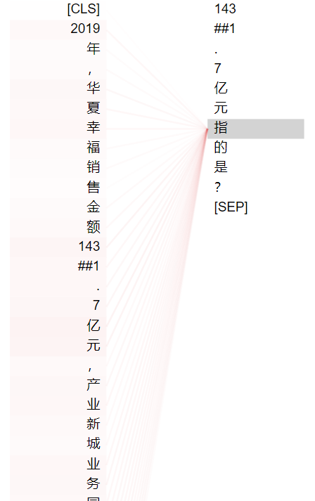
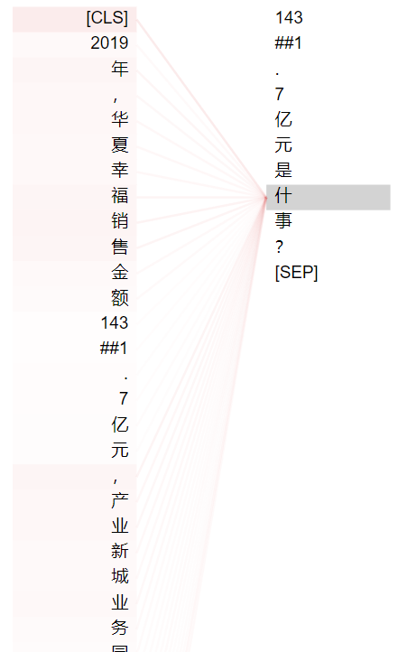
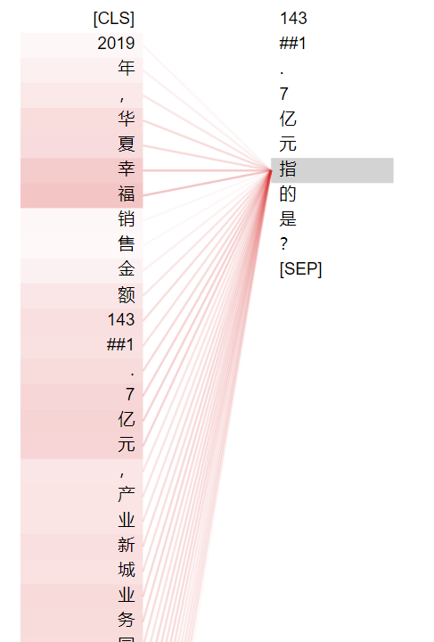
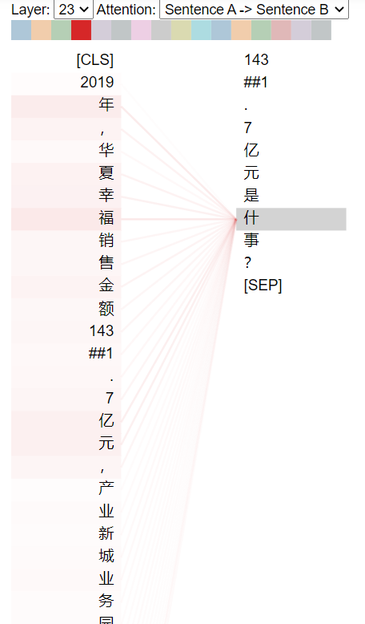

### attention virtualization

Unsupervise下，是什事？和指的是？差别不是很大

但是相对来说，比较关键的问句字符当中，什的attention比指的attention更集中，并且集中在目标上面

supervise下，是什事？和指的是？差别较大

相对来说，指的attention比较强，但是相对也比较散

而什的attention主要集中在target附近

从结果，attention，数据，test结果各方面综合来解释

是什事？的可解释性

是、？这两个相当于做提问的标志位，是--理解为英文中的is或者are，？即问句

什，可以理解为 什么--即提问数值指代的基本语句

事，可以理解为 发生了什么事--隐含数值指代的动态提问，例如说增长、比XXX多，不少于等信息

但是事字的训练，在原始的小样本训练数据里面几乎是没有什么的，这部分可以添加部分样本一起训练。

现在还不足的两个方面

面向领域的数值单位，以及数值模式（抽取阶段）

在理解层面，某个数值为一个动态含义，例如什么比什么多，什么增长，包含比较的一些概念，以及概念跨越span

其他部分基本上没有什么提升了
